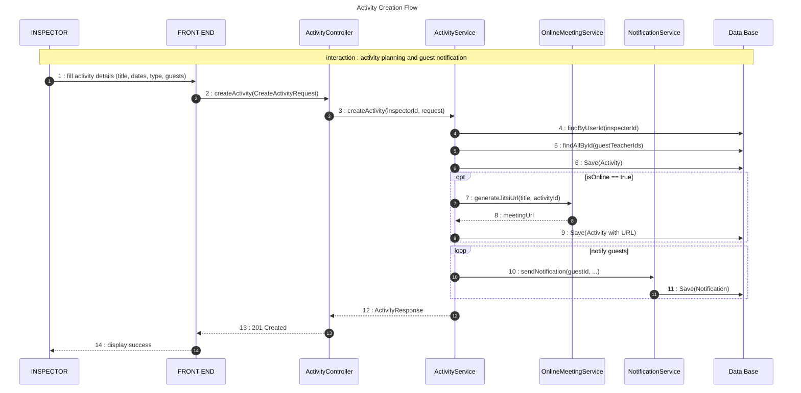
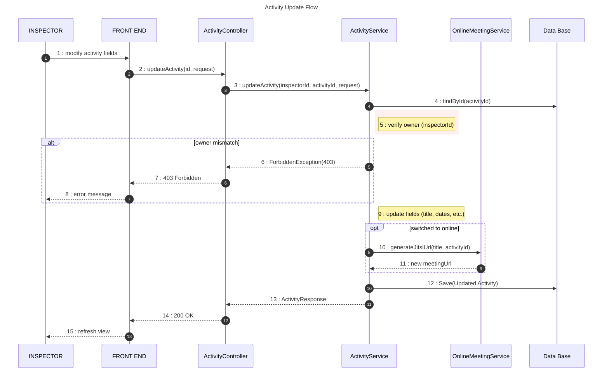
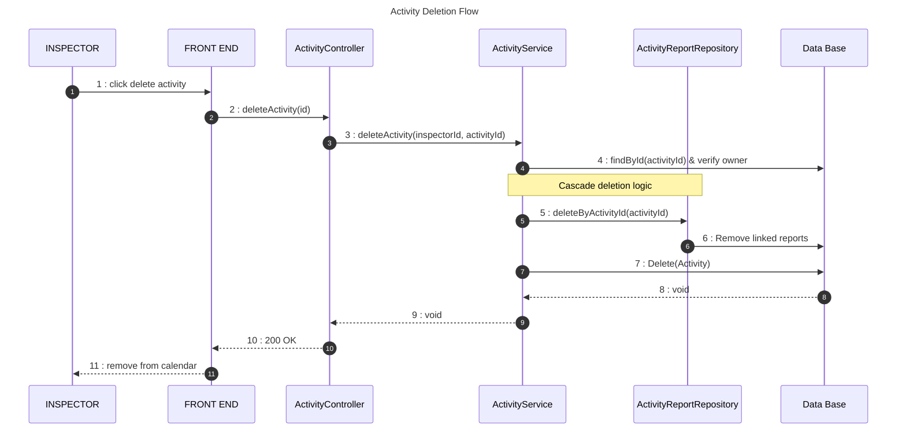

# Activity Management Sequence Diagram (Full CRUD)

This diagram documents the complete lifecycle of a pedagogical activity, including secure updates and cascade deletion logic.

## 🔄 Sequence 1: Activity Creation Flow

## 🔄 Sequence 2: Activity Update Flow

## 🔄 Sequence 3: Activity Deletion Flow

## 📋 Key Operations

| Operation | Component | Security/Logic |
| :--- | :--- | :--- |
| **Update** | `ActivityService` | Implements a **Forbidden Check** to ensure only the creator can modify an activity. |
| **Online Toggle** | `OnlineMeetingService` | Dynamically provisions a Jitsi room if an activity is moved from "Physical" to "Online". |
| **Deletion** | `ActivityReportRepository` | Handles **Foreign Key constraints** by removing associated reports before deleting the parent activity. |
