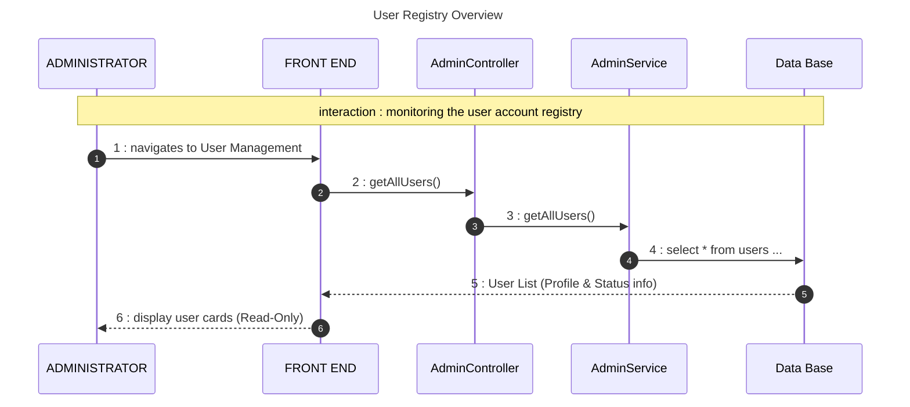
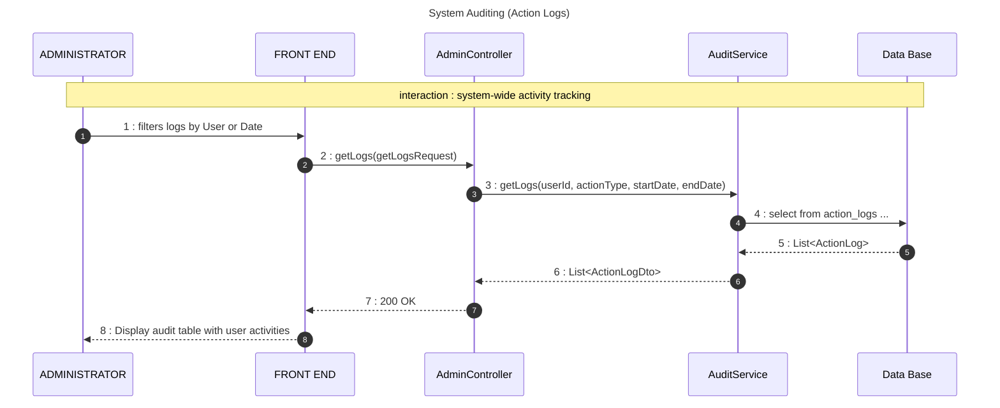
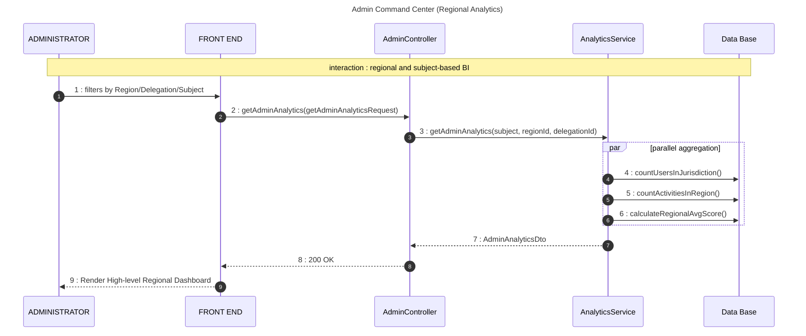

# Admin Management Sequence Diagram

This diagram documents the administrative control plane, which is focused on monitoring and analysis, including user registry oversight, system auditing (Action Logs), and high-level regional analytics.

## 🔄 Sequence 1: User Registry Overview

## 🔄 Sequence 2: System Auditing (Action Logs)

## 🔄 Sequence 3: Admin Command Center (Analytics)

## 📋 Key Operations

| Operation | Component | Description |
| :--- | :--- | :--- |
| **Registry** | `AdminService` | **Read-Only** overview of all platform users to monitor registration volume and profile completeness. |
| **Auditing** | `AuditService` | Provides a historical timeline of all critical system actions (logins, report finalizations, quiz submissions). |
| **Regional BI** | `AnalyticsService` | Aggregates data at the Region and Delegation levels, allowing Admins to compare pedagogical performance across the country. |
| **Security** | `PreAuthorize` | Strictly enforces `hasRole('ADMIN')` at the Controller level for all operations. |
