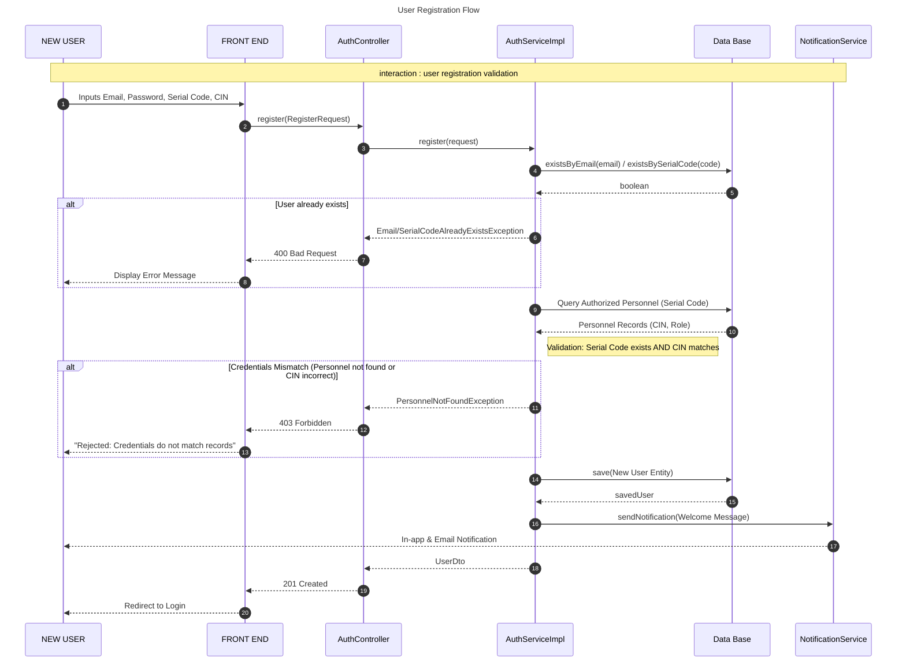
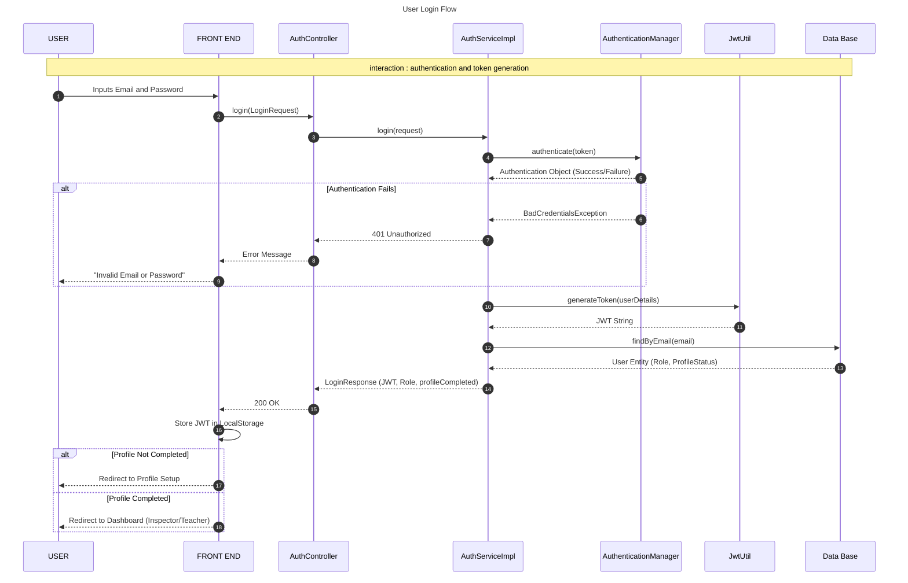
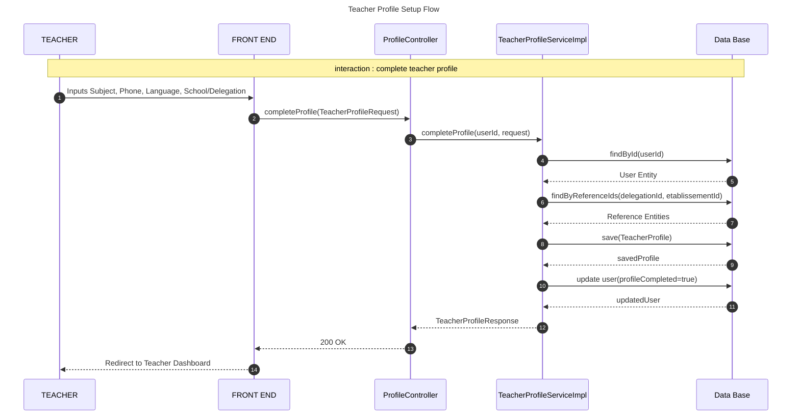
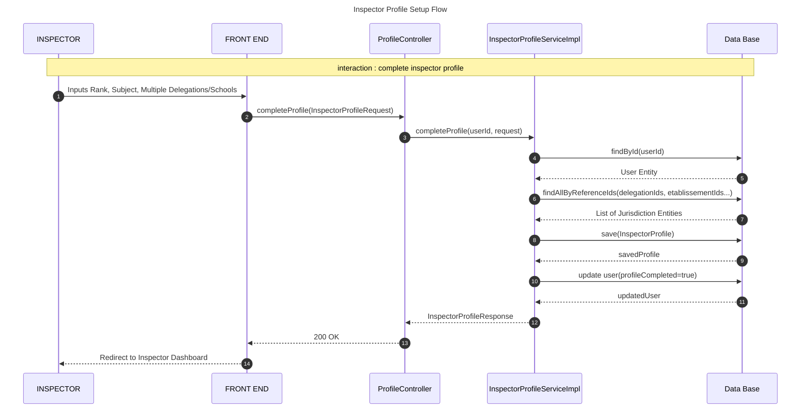

# Authentication & Profile Setup Sequence Diagrams

This document contains UML sequence diagrams for the core identity and onboarding flows of the Inspector Platform.

## 1. User Registration Flow
This diagram illustrates how a user registers by validating their Serial Code and CIN against the national personnel database.

## 2. User Login Flow
This diagram shows the secure authentication process using JWT tokens.

## 3. Teacher Profile Setup Flow
This diagram illustrates the specialized onboarding for teachers after their initial registration.

## 4. Inspector Profile Setup Flow
This diagram illustrates the specialized onboarding for inspectors, including multi-jurisdiction assignments.

