# Inspector Platform - Complete Class Diagram

This diagram provides a total architectural overview of the platform, documenting every functional module from core identity to the AI evaluation and learning systems.

```mermaid
classDiagram
    %% --- DOMAIN 1: IDENTITY & ACCESS ---
    class User {
        +Long id
        +String email
        +String serialCode
        +Role role
        +boolean enabled
        +boolean profileCompleted
        +String profileImageUrl
    }

    class InspectorProfile {
        +Long id
        +String firstName
        +String lastName
        +Subject subject
        +InspectorRank rank
    }

    class TeacherProfile {
        +Long id
        +String firstName
        +String lastName
        +Subject subject
    }

    class Personnel {
        +Long id
        +String serialCode
        +String cin
        +Role role
    }

    %% --- DOMAIN 2: REGIONAL ORGANIZATION ---
    class Region {
        +Long id
        +String name
    }
    class Delegation {
        +Long id
        +String name
    }
    class Dependency {
        +Long id
        +String name
    }
    class Etablissement {
        +Long id
        +String name
        +String code
    }

    %% --- DOMAIN 3: PEDAGOGICAL ACTIVITIES ---
    class Activity {
        +Long id
        +String title
        +ActivityType type
        +boolean isOnline
        +String meetingUrl
    }

    class ActivityReport {
        +Long id
        +String observations
        +Integer score
        +ReportStatus status
    }

    %% --- DOMAIN 4: AI & EVALUATION ---
    class Quiz {
        +Long id
        +String title
        +Subject subject
        +String topic
    }

    class QuizSubmission {
        +Long id
        +Integer score
        +String aiFeedback
    }

    %% --- DOMAIN 5: PROFESSIONAL LEARNING (COURSES) ---
    class Course {
        +Long id
        +String title
        +String description
        +Subject subject
    }

    class CourseModule {
        +Long id
        +String title
    }
    class CourseLesson {
        +Long id
        +String title
        +LessonType type
    }
    class CourseAssignment {
        +Long id
        +String content
    }
    class LessonProgress {
        +Long id
        +boolean completed
    }

    %% --- DOMAIN 6: COMMUNICATION & SYSTEM ---
    class Conversation {
        +Long id
        +LocalDateTime lastMessageAt
    }
    class Message {
        +Long id
        +String content
        +boolean isRead
    }
    class Notification {
        +Long id
        +String title
        +String content
        +boolean read
    }
    class ActionLog {
        +Long id
        +ActionType action
        +String description
    }

    %% --- SERVICE LAYER (BEHAVIORAL) ---
    class AuthService {
        <<interface>>
        +login(LoginRequest)
        +register(RegisterRequest)
        +forgotPassword(email)
    }

    class ActivityService {
        <<interface>>
        +createActivity(inspectorId, req)
        +updateActivity(inspectorId, id, req)
        +deleteActivity(inspectorId, id)
    }

    class QuizService {
        <<interface>>
        +generateAIQuestions(topic, subject)
        +submitQuiz(teacherId, quizId, answers)
        +evaluateSubmission(context, answers)
    }

    class CourseService {
        <<interface>>
        +createCourse(inspectorId, req)
        +assignCourse(courseId, teacherId)
        +updateLessonProgress(teacherId, lessonId)
    }

    class MessengerService {
        <<interface>>
        +sendMessage(senderId, recipientId, content)
        +getConversations(userId)
    }

    %% --- RELATIONSHIPS ---
    User "1" -- "0..1" InspectorProfile : extends
    User "1" -- "0..1" TeacherProfile : extends
    User "*" -- "1" Personnel : validated by

    Region "1" -- "*" Delegation : hierarchy
    Delegation "1" -- "*" Dependency : hierarchy
    Delegation "1" -- "*" Etablissement : hierarchy

    InspectorProfile "1" -- "*" Activity : manages
    Activity "1" -- "0..1" ActivityReport : results in
    TeacherProfile "1" -- "*" ActivityReport : evaluated

    InspectorProfile "1" -- "*" Quiz : creates
    Quiz "1" -- "*" QuizSubmission : receives
    TeacherProfile "1" -- "*" QuizSubmission : performs

    InspectorProfile "1" -- "*" Course : authors
    Course "1" -- "*" CourseModule : contains
    CourseModule "1" -- "*" CourseLesson : contains
    TeacherProfile "1" -- "*" LessonProgress : tracks

    User "1" -- "*" Conversation : participates
    Conversation "1" -- "*" Message : contains
    User "1" -- "*" Notification : receives
    User "1" -- "*" ActionLog : audited
```

## 📋 Platform Modules Overview

| Module | Core Logic | Key Entities |
| :--- | :--- | :--- |
| **Identity** | Validated registration against Personnel records. | `User`, `Personnel`, `Profiles` |
| **Regional** | Jurisdiction-based data isolation. | `Region`, `Delegation`, `Dependency` |
| **Pedagogy** | Supervision, Activities, and formal Reports. | `Activity`, `ActivityReport` |
| **AI Quiz** | Automated generation and evaluation (Gemini). | `Quiz`, `QuizSubmission` |
| **E-Learning** | Structured professional training courses. | `Course`, `Lesson`, `Progress` |
| **Messenger** | Real-time professional collaboration. | `Conversation`, `Message` |
| **Governance** | Regional BI analytics and system auditing. | `Analytics`, `ActionLog` |
