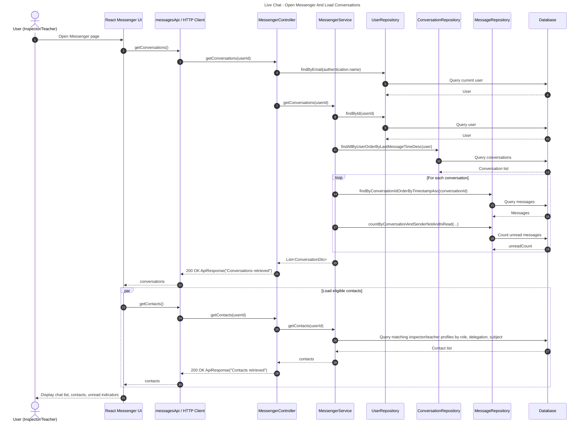
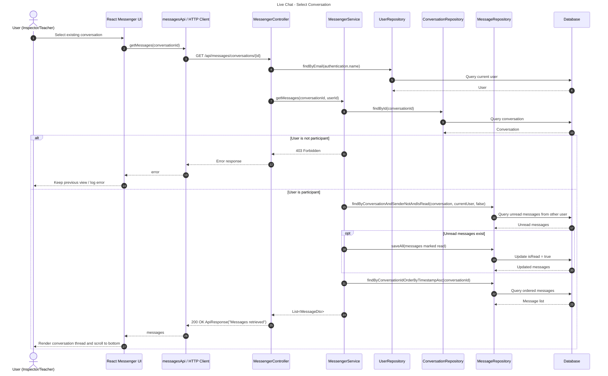
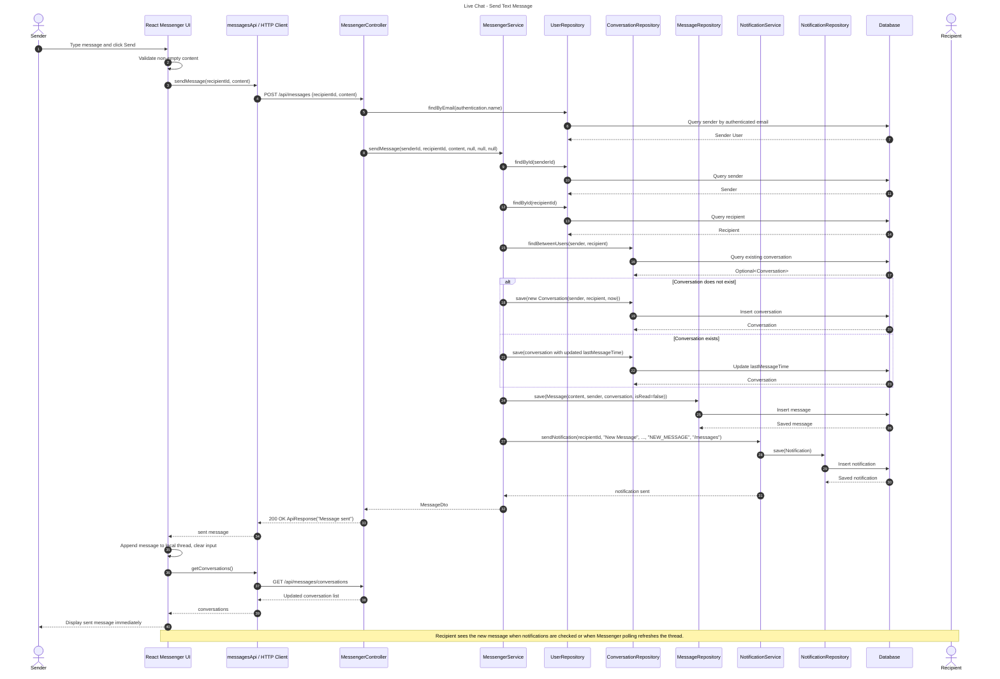
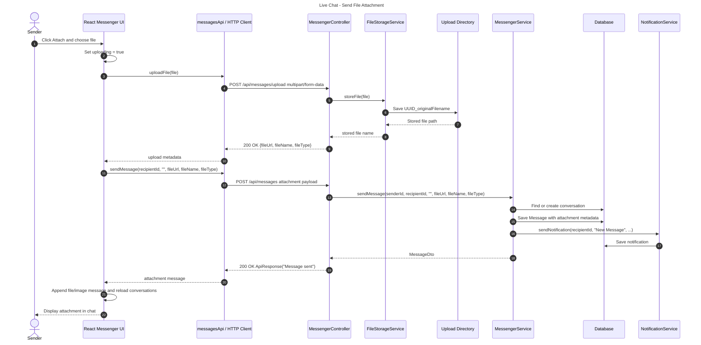
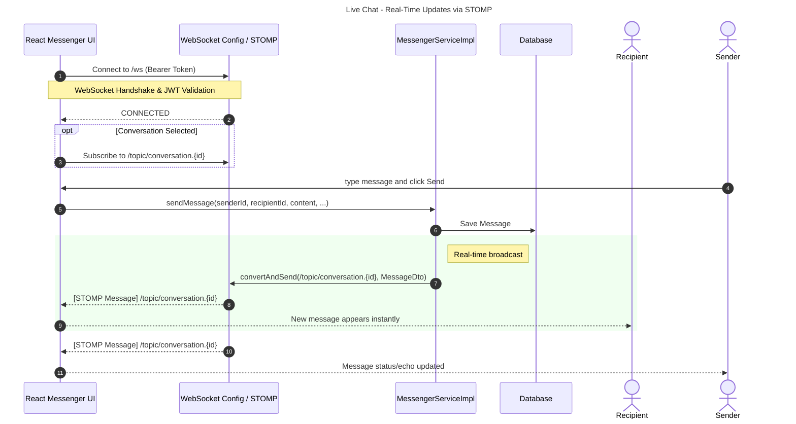

# Live Chat Feature Sequence Diagram

This sequence diagram documents the implemented Messenger flow for Inspector/Teacher communication. The current implementation uses authenticated REST APIs plus periodic polling from the frontend to refresh conversations and messages.

## Sequence 1: Open Messenger And Load Data

## Sequence 2: Select Conversation And Mark Messages As Read

## Sequence 3: Send Text Message

## Sequence 4: Send File Attachment

## Sequence 5: Real-Time WebSocket Updates (STOMP)

## Key Implementation Notes

| Concern | Implemented behavior |
| :--- | :--- |
| Authentication | `MessengerController` resolves the current user from `Authentication.getName()` and `UserRepository.findByEmail(...)`. |
| Contact eligibility | Inspectors see teachers with matching delegation and subject; teachers see inspectors with matching delegation and subject. |
| Conversation creation | `MessengerServiceImpl.sendMessage(...)` creates the conversation if no existing conversation is found between both users. |
| Read status | Opening a conversation marks unread messages from the other participant as read. |
| Live update strategy | Real-time messaging implemented via STOMP over WebSocket. Clients subscribe to conversation-specific topics. |
| Attachments | Files are uploaded first through `/api/messages/upload`, then sent as message metadata through `/api/messages`. |
| Notifications | After each message is saved, `SimpMessagingTemplate` broadcasts to the WebSocket topic, and `NotificationService` creates a persistent notification. |
