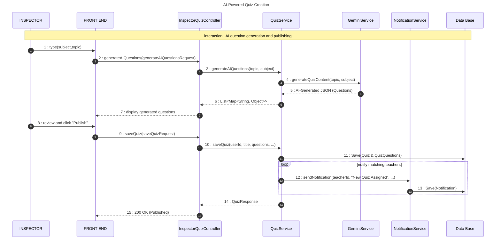
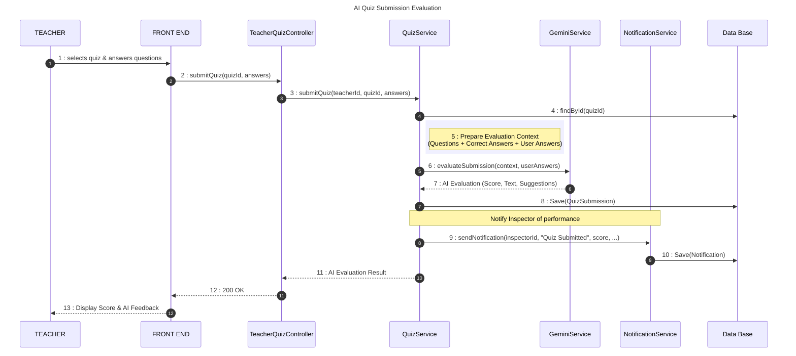

# AI Quiz Management Sequence Diagram

This diagram documents the advanced pedagogical evaluation flow, where AI (Gemini) is used to generate questions and evaluate teacher submissions.

## 🔄 Sequence 1: AI-Powered Quiz Creation (Inspector)

## 🔄 Sequence 2: Quiz Submission & AI Evaluation (Teacher)

## 📋 Key Operations

| Operation | Component | AI Role |
| :--- | :--- | :--- |
| **Generation** | `GeminiService` | Generates contextually relevant pedagogical questions based on the selected Subject and Topic. |
| **Publishing** | `NotificationService` | Automatically alerts all teachers who share the same Subject as the newly created quiz. |
| **Evaluation** | `GeminiService` | Analyzes answers (including open text) to provide a score, critical feedback, and training suggestions. |
| **Submission** | `QuizRepository` | Prevents double submission (Conflict 409) to ensure evaluation integrity. |
