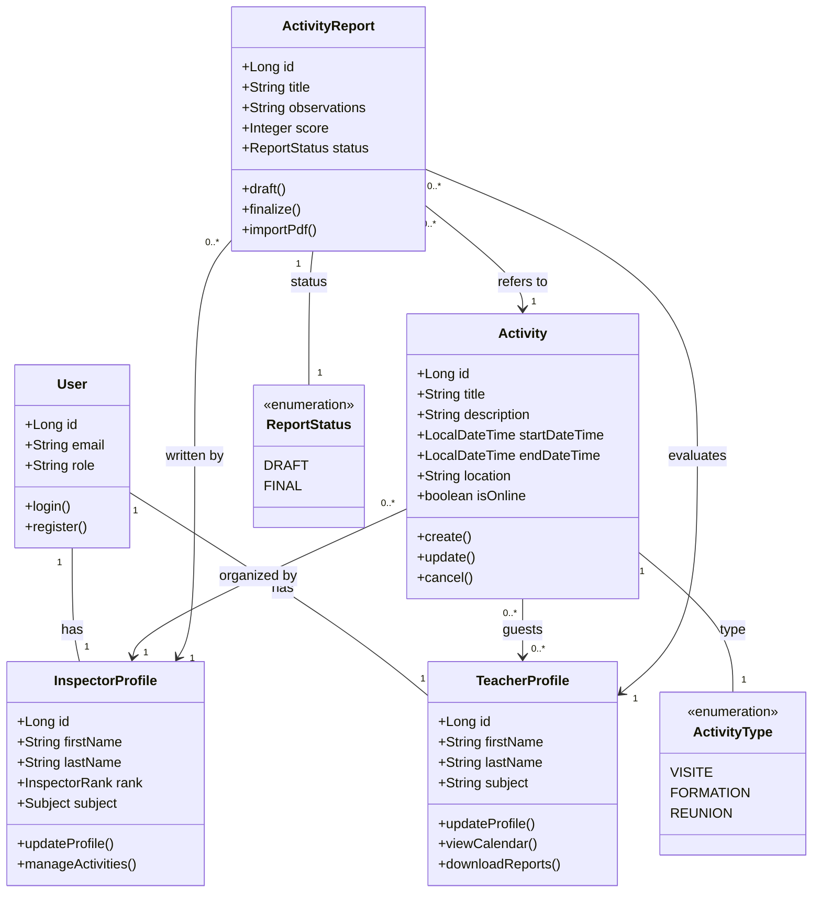
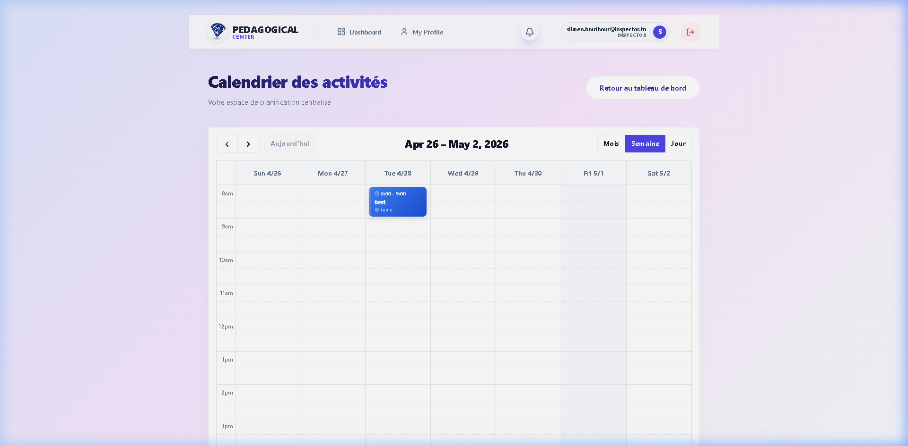
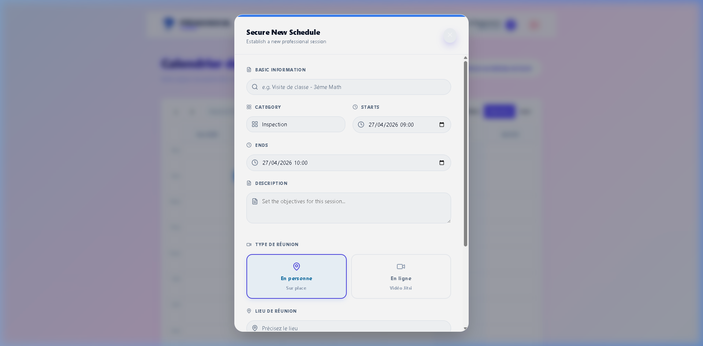
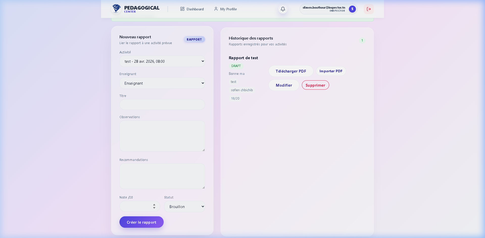
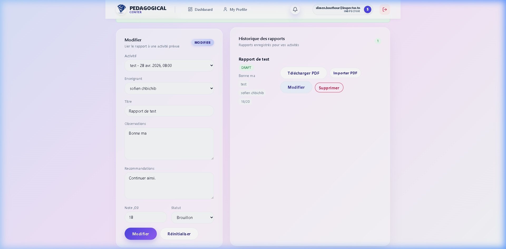

# Chapter 4: Implementation (Sprint 2)

## 4.2 Sprint 2: Pedagogical Supervision

### 4.2.1 Sprint Objective
The objective of this sprint is to implement the core pedagogical supervision cycle. This allows Inspectors to plan and conduct activities (visits/formations) and document results in evaluation reports. Simultaneously, it enables Teachers to track their pedagogical schedule and access finalized professional feedback through secure report downloads.

### 4.2.2 Sprint Backlog
| ID | Feature | ID US | User Story | Priority |
| :--- | :--- | :--- | :--- | :--- |
| **F4** | **Activity Management** | US4.1 | As an Inspector, I want to create, update, and cancel pedagogical activities. | High |
| | | US4.2 | As an Inspector, I want to assign one or more teachers to a specific activity. | High |
| | | US4.3 | As a Teacher, I want to view my upcoming pedagogical sessions in a synchronized calendar. | High |
| **F5** | **Online Integration** | US5.1 | As an Inspector, I want to generate Jitsi Meet rooms automatically for virtual activities. | Medium |
| | | US5.2 | As a Participant, I want to join the virtual room directly from the activity details. | Medium |
| **F6** | **Evaluation Reports** | US6.1 | As an Inspector, I want to draft pedagogical reports with scores and recommendations. | High |
| | | US6.2 | As an Inspector, I want to finalize a report to lock its content and share it with the teacher. | High |
| | | US6.3 | As an Inspector, I want to import/upload a scanned PDF version of a physical report. | Medium |
| | | US6.4 | As a Teacher, I want to download my finalized reports as high-quality PDF documents. | Medium |
| **F7** | **Automated Alerts** | US7.1 | As a Teacher, I want to receive an email notification when a report is finalized. | Medium |
| | | US7.2 | As a Teacher, I want to receive in-app notifications for new activity invitations. | Low |

### 4.2.3 Main Actors and Roles
This sprint involves three primary actors who interact to complete the pedagogical supervision cycle:

*   **Inspector**: Acts as the primary orchestrator of the pedagogical cycle. They are responsible for planning sessions, managing the professional calendar, conducting evaluations (both in-person and online), and drafting formal reports.
*   **Teacher**: Acts as the beneficiary of the supervision. They use the platform to stay updated on their pedagogical schedule, participate in scheduled sessions, and access their digitized evaluation results.
*   **Email System**: Acts as a secondary system actor that facilitates real-time communication by dispatching automated alerts for key events like session invitations and report finalization.
*   **Data Base**: Acts as the central persistence layer. It is responsible for storing the professional calendar data, maintaining the version history of pedagogical reports, and ensuring that all finalized evaluations are archived securely for future consultation.

### 4.2.4 Class Diagram
The following class diagram represents the structural model for the pedagogical supervision module, highlighting the relationships between scheduling and evaluation.



### 4.2.5 Use Case Diagram
This diagram outlines the primary interactions during the pedagogical supervision cycle, highlighting the distinct roles of the Inspector and the Teacher.

```mermaid
useCaseDiagram
    actor "Inspector" as INS
    actor "Teacher" as TCH
    actor "Email System" as MAIL <<System>>
    
    package "Pedagogical Supervision System" {
        usecase "Manage Pedagogical Activities" as UC1
        usecase "Join Online Session (Jitsi)" as UC2
        usecase "Draft & Finalize Reports" as UC3
        usecase "Import External PDF Reports" as UC4
        usecase "Consult Pedagogical Calendar" as UC5
        usecase "Download Evaluation PDF" as UC6
        usecase "Process System Notifications" as UC7
    }

    INS --> UC1
    INS --> UC2
    INS --> UC3
    INS --> UC4
    INS --> UC5

    TCH --> UC2
    TCH --> UC5
    TCH --> UC6
    TCH --> UC7

    UC3 ..> UC7 : <<include>>
    UC1 ..> UC7 : <<include>>
    
    UC7 --> MAIL : "Dispatches Alerts"
```

### 4.2.6 Analysis of the Sprint
The focus of this sprint is to digitize the core pedagogical monitoring process. It provides **Inspectors** with the tools to organize their professional calendar by scheduling visits, formations, and meetings with teachers. These activities can be conducted in-person or virtually through a built-in **Online Meeting** integration.

Once an activity is completed, the system allows for the creation of **Evaluation Reports**. These reports are drafted by the inspector and, once finalized, become available to the **Teacher** for consultation and PDF download. To keep everyone informed, the platform includes an **Automated Email System** that sends instant alerts for new invitations and finalized reports. All these features are designed to respect professional working hours, ensuring a structured and organized supervision environment.

### 4.2.7 Descriptive Table of Use Case: Manage Pedagogical Activities
| Element | Description |
| :--- | :--- |
| **Use Case** | **Manage Pedagogical Activities** |
| **Actors** | Inspector |
| **Pre-conditions** | Inspector must be authenticated. |
| **Post-conditions** | Activity is scheduled, updated, or removed; Guests are notified. |
| **Nominal Scenario** | 1. Inspector selects a date/time on the calendar.<br>2. Inspector enters title, type, and location.<br>3. Inspector assigns one or more teachers.<br>4. System validates time constraints (8 AM - 5 PM, no Sundays).<br>5. System saves activity and notifies assigned teachers. |
| **Exceptions** | - **Time Conflict**: Activity falls outside working hours.<br>- **Invalid Data**: Required fields missing. |

### 4.2.8 Descriptive Table of Use Case: Join Online Session (Jitsi)
| Element | Description |
| :--- | :--- |
| **Use Case** | **Join Online Session (Jitsi)** |
| **Actors** | Inspector, Teacher |
| **Pre-conditions** | An online activity must be scheduled and ongoing. |
| **Post-conditions** | Participants are connected via video/audio. |
| **Nominal Scenario** | 1. Actor opens the activity details from their calendar.<br>2. Actor clicks the "Join Online Meeting" button.<br>3. System redirects to the secure Jitsi Meet room.<br>4. Actor participates in the virtual pedagogical session. |
| **Exceptions** | - **Room Not Found**: Jitsi link is invalid.<br>- **Permissions**: Browser denies camera/microphone access. |

### 4.2.9 Descriptive Table of Use Case: Finalize Evaluation Report
| Element | Description |
| :--- | :--- |
| **Use Case** | **Finalize Pedagogical Report** |
| **Actors** | Inspector |
| **Pre-conditions** | An activity must have been completed; a draft report must exist. |
| **Post-conditions** | Report status is set to `FINAL`; Teacher is notified via email. |
| **Nominal Scenario** | 1. Inspector opens the draft report.<br>2. Inspector enters scores and observations.<br>3. Inspector clicks "Finalize".<br>4. System locks the report and sends email notification.<br>5. System updates teacher performance insights. |
| **Exceptions** | - **Validation Error**: Score out of range (Rejected).<br>- **Already Final**: Report cannot be edited after finalization. |

### 4.2.10 Descriptive Table of Use Case: Import External PDF Reports
| Element | Description |
| :--- | :--- |
| **Use Case** | **Import External PDF Reports** |
| **Actors** | Inspector |
| **Pre-conditions** | A report entry must exist in the system. |
| **Post-conditions** | A physical document is digitized and attached to the record. |
| **Nominal Scenario** | 1. Inspector selects "Import PDF" on a report record.<br>2. Inspector uploads a scanned evaluation document.<br>3. System stores the file and associates it with the report.<br>4. Teacher can now access the digitized version. |
| **Exceptions** | - **File Type Error**: Uploaded file is not a PDF.<br>- **File Size**: Document exceeds maximum storage limit. |

### 4.2.11 Descriptive Table of Use Case: Consult and Download Report
| Element | Description |
| :--- | :--- |
| **Use Case** | **Consult and Download Report** |
| **Actors** | Teacher |
| **Pre-conditions** | Inspector must have finalized the report. |
| **Post-conditions** | Teacher possesses a digital PDF copy of the evaluation. |
| **Nominal Scenario** | 1. Teacher receives notification of report finalization.<br>2. Teacher logs into the platform.<br>3. Teacher navigates to "My Reports".<br>4. Teacher views report details and clicks "Download PDF".<br>5. System generates and delivers the PDF document. |
| **Exceptions** | - **Report Not Found**: Requested report ID is invalid.<br>- **Unauthorized**: Teacher tries to access another teacher's report. |

### 4.2.12 Description of Sequence Diagrams
This section presents the sequence diagrams that illustrate the dynamic interactions within the pedagogical supervision workflows.

**1. Activity Creation & Planning**
Illustrates the process by which an Inspector schedules a new pedagogical session. It covers the submission of session details, the automatic validation of time constraints, the persistence of the activity record, and the dispatch of invitation notifications to all assigned teachers.

**2. Report Drafting & Update**
Describes the iterative workflow for creating and modifying an evaluation report. It shows how the Inspector fills in the report content and how the system validates that the report has not already been finalized before saving any changes.

**3. Report Finalization & Locking**
Captures the critical moment when an Inspector finalizes a report. It shows the locking of the report content to prevent further edits, followed by the automatic dispatch of an email notification to the evaluated teacher.

**4. Consult & Download PDF**
Details the Teacher's journey after receiving a finalization notification. It shows how the system verifies the report status and generates the PDF document for secure download.

**5. Join Online Session (Jitsi)**
Represents the virtual meeting integration. It shows how either the Inspector or the Teacher can access the Jitsi meeting link associated with a scheduled online activity and join the secure virtual classroom.

### 4.2.13 Interface Demonstrations
The following screenshots illustrate the key interfaces implemented during this sprint.

**Figure 1 – Inspector Activity Calendar**: The Inspector's weekly scheduling calendar displaying all planned pedagogical activities in a time-grid layout.



---

**Figure 2 – Activity Creation Form**: The modal form for scheduling a new session, with fields for title, category, datetime, and a toggle between in-person and online (Jitsi) types.



---

**Figure 3 – Report Management Page**: The dual-panel interface for creating reports (left) and consulting the report history with their status and action buttons (right).



---

**Figure 4 – Report Draft Editor**: The edit mode of a draft report, allowing the Inspector to update observations, score, and status before finalization.



---

**Figure 5 – Teacher Report Management Page**: The Teacher's view of their evaluation records, showing report details, scores, and action buttons to download or import PDF documents.


### 4.2.14 Backlog Conclusion
Sprint 2 successfully digitizes the traditional inspection cycle, providing significant value to all stakeholders:

*   **For Inspectors**: It offers a streamlined digital workspace to organize their professional agenda, conduct virtual visits, and produce formal evaluations with automated state management.
*   **For Teachers**: It ensures a more transparent and responsive experience. Teachers no longer wait for physical paperwork; they receive instant notifications of their schedule and can immediately download their professional records once finalized.

By bridging the communication gap between supervisors and practitioners, the platform fosters a more efficient and collaborative professional development environment.
