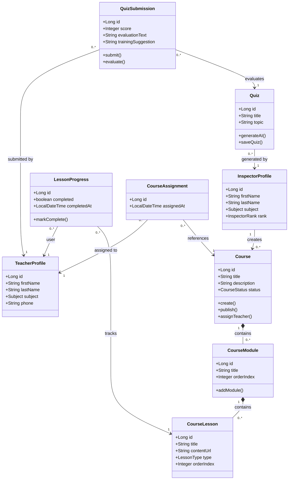

# Chapter 4: Implementation (Sprint 3)

## 4.3 Sprint 3: Course Management & AI Training

### 4.3.1 Sprint Objective
The objective of this sprint is to implement a comprehensive pedagogical training system. This includes structured Course Management (creating modules and lessons) and the integration of Artificial Intelligence (Google Gemini) to automate quiz generation and provide teachers with personalized evaluation feedback.

### 4.3.2 Sprint Backlog
| ID | Feature | ID US | User Story | Priority |
| :--- | :--- | :--- | :--- | :--- |
| **F7** | **Course Management** | US7.1 | As an Inspector, I want to create a new pedagogical course by defining its title, description, and target subject. | High |
| | | US7.2 | As an Inspector, I want to organize a course by creating a hierarchy of distinct Modules. | High |
| | | US7.3 | As an Inspector, I want to upload or link specific Lessons (PDFs, Video URLs) into the respective modules. | High |
| | | US7.4 | As an Inspector, I want to assign a finalized course to a specific set of teachers for targeted professional development. | High |
| | | US7.5 | As a Teacher, I want to view a personalized dashboard of all courses assigned to me by my inspector. | High |
| | | US7.6 | As a Teacher, I want to track my progression through a course by marking individual lessons as completed. | Medium |
| **F8** | **AI Quiz Generation** | US8.1 | As an Inspector, I want to prompt the AI system by specifying a pedagogical topic to generate a contextual quiz. | High |
| | | US8.2 | As an Inspector, I want the system to parse the AI's response into structured multiple-choice questions with rationales. | High |
| | | US8.3 | As an Inspector, I want to manually review, edit, and ultimately publish the AI-generated quiz to make it active. | Medium |
| **F9** | **Automated Eval** | US9.1 | As a Teacher, I want to access and complete an active pedagogical quiz directly within the platform. | High |
| | | US9.2 | As an Inspector, I want the system to automatically calculate a teacher's numeric score upon submission for my review. | High |
| | | US9.3 | As an Inspector, I want to receive qualitative AI feedback on teacher answers to help me provide better pedagogical guidance. | High |

### 4.3.3 Main Actors and Roles
This sprint involves three primary actors interacting within the training ecosystem:

* **Inspector**: Acts as the content creator and curriculum manager. They build structured courses, assign them to educators, and use AI tools to quickly generate evaluation quizzes.
* **Teacher**: Acts as the learner. They consume the pedagogical course material, complete lessons, and take quizzes that are then submitted for inspector evaluation.
* **AI Service (Google Gemini)**: Acts as an intelligent backend engine responsible for generating quiz questions, validating answers, and formulating qualitative pedagogical insights for the inspector.
* **Database (MySQL)**: The persistence layer responsible for storing structured curriculum data, AI-generated questions, teacher progression logs, and quiz results.
* **Notification System**: A communication bridge (In-app alerts & Email via SMTP) that ensures teachers are immediately informed when new courses or quizzes are assigned to them.

### 4.3.4 Class Diagram
The following class diagram represents the structural model for the Course Management and AI Evaluation module, detailing the entities and their logical interactions.



### 4.3.5 Descriptive Analysis of Classes:
*   **InspectorProfile & TeacherProfile**: These core entities link the training module to the human actors. The Inspector acts as the content creator and auditor, while the Teacher acts as the primary learner.
*   **Course & CourseModule**: Represent the hierarchical curriculum. A course is logically partitioned into modules to provide a structured pedagogical progression.
*   **CourseLesson**: The primary unit of learning content (PDF, Video, etc.). It maintains its sequence within a module via the `orderIndex`.
*   **LessonProgress**: Tracks individual teacher progress across the curriculum. It records completion status and timestamps, allowing for real-time engagement monitoring.
*   **CourseAssignment**: A junction entity that manages the relationship between published courses and the teachers selected by the inspector for professional development.
*   **Quiz & QuizSubmission**: The intelligent assessment layer. Quizzes are generated using the Google Gemini AI, while submissions store both quantitative scores and qualitative pedagogical feedback.

### 4.3.6 Use Case Diagram
This diagram outlines the primary interactions for managing training content and taking AI-driven evaluations.

```mermaid
useCaseDiagram
    actor "Inspector" as INS
    actor "Teacher" as TCH
    actor "Google Gemini AI" as AI <<System>>
    actor "MySQL DB" as DB <<System>>
    actor "Notification/Mail" as NTF <<System>>
    
    package "Pedagogical Training & AI Module" {
        usecase "Create Course & Modules" as UC1
        usecase "Assign Course to Teachers" as UC2
        usecase "Generate Quiz via Prompt" as UC3
        
        usecase "Track Lesson Progress" as UC4
        usecase "Take Pedagogical Quiz" as UC5
        usecase "View Teacher Evaluation" as UC6
        usecase "Evaluate Answers (AI)" as UC7
    }

    INS --> UC1
    INS --> UC2
    INS --> UC3
    INS --> UC6
    
    TCH --> UC4
    TCH --> UC5

    UC1 --> DB : "Persists Content"
    UC2 --> NTF : "Triggers Alerts"
    UC3 --> AI : "Requests Content"
    UC4 --> DB : "Updates Progress"
    UC5 --> DB : "Stores Submission"
    UC5 ..> UC7 : <<include>>
    UC7 --> AI : "Analyzes Performance"
    UC7 ..> UC6 : <<include>>
```

### 4.3.7 Analysis of the Sprint
This sprint introduces both the **Curriculum Layer** and the **Intelligence Layer** of the platform. The addition of Course Management allows Inspectors to move beyond one-off inspections and actively curate structured learning paths. They can upload lessons (documents, videos) and group them into modules.

To complement this, we integrated the **Google Generative AI (Gemini)** API and a robust **MySQL** database via JPA/Hibernate. The system handles the complex mapping of AI-generated JSON into relational tables, ensuring the persistence of all pedagogical content. Furthermore, we implemented an automated **Notification Engine** using Spring Mail (SMTP), which proactively alerts teachers when new professional development materials are assigned to them. For the teachers, submitting a quiz triggers an asynchronous call to the AI engine, which generates a qualitative evaluation of their understanding. This evaluation is then presented to the **Inspector**, providing them with actionable pedagogical insights to better support their teachers' professional development, rather than just seeing a numeric score.

### 4.3.8 Descriptive Table of Use Case: Manage Pedagogical Course
| Element | Description |
| :--- | :--- |
| **Use Case** | **Manage Pedagogical Course** |
| **Actors** | Inspector |
| **Pre-conditions** | Inspector must be authenticated. |
| **Post-conditions** | A structured course is created, populated with lessons, and assigned. |
| **Nominal Scenario** | 1. Inspector creates a new Course with a title and description.<br>2. Inspector adds Modules to structure the curriculum.<br>3. Inspector uploads or links Lessons (PDFs, Video URLs) into the modules.<br>4. Inspector selects target Teachers to assign the course.<br>5. System notifies the assigned teachers and updates their learning dashboard. |
| **Exceptions** | - **Validation Error**: Course is saved without any lessons (Warning). |

### 4.3.9 Descriptive Table of Use Case: Generate AI-Driven Quiz
| Element | Description |
| :--- | :--- |
| **Use Case** | **Generate AI-Driven Pedagogical Quiz** |
| **Actors** | Inspector, Google Gemini AI |
| **Pre-conditions** | Inspector must be authenticated and specify a topic. |
| **Post-conditions** | A new Quiz entity is populated with AI-generated questions. |
| **Nominal Scenario** | 1. Inspector enters a pedagogical topic (e.g., "Active Learning").<br>2. System constructs a strict JSON schema prompt.<br>3. System makes an asynchronous call to the Gemini API.<br>4. System parses the AI JSON response into `QuizQuestion` entities.<br>5. Inspector reviews and publishes the quiz. |
| **Exceptions** | - **AI Timeout**: If the API is unavailable, the user is notified.<br>- **Parsing Error**: If the AI returns malformed JSON, the system attempts a retry or shows an error. |

### 4.3.10 Descriptive Table of Use Case: Take Pedagogical Quiz
| Element | Description |
| :--- | :--- |
| **Use Case** | **Take Pedagogical Quiz** |
| **Actors** | Teacher, MySQL DB |
| **Pre-conditions** | Teacher must be assigned to the quiz and it must be active. |
| **Post-conditions** | Submission is persisted; Teacher receives a confirmation message. |
| **Nominal Scenario** | 1. Teacher selects an assigned quiz from their training dashboard.<br>2. System renders the quiz questions (MCQs or Open-ended).<br>3. Teacher submits their answers.<br>4. System validates completion and persists the `QuizSubmission` record.<br>5. System triggers the AI evaluation engine and notifies the inspector. |
| **Exceptions** | - **Duplicate Submission**: Teacher attempts to take a quiz they have already completed (Blocked). |

### 4.3.11 Descriptive Table of Use Case: Review Teacher Evaluation
| Element | Description |
| :--- | :--- |
| **Use Case** | **Review Teacher Evaluation Result** |
| **Actors** | Inspector, MySQL DB |
| **Pre-conditions** | At least one teacher must have submitted the quiz. |
| **Post-conditions** | Inspector has consulted the score and AI-generated insights. |
| **Nominal Scenario** | 1. Inspector navigates to the Quiz Results section.<br>2. Inspector selects a specific quiz to view its submission list.<br>3. Inspector clicks on a Teacher's submission record.<br>4. System retrieves the numeric score and the AI-generated `evaluationText`.<br>5. Inspector reviews the AI's `trainingSuggestion` to prepare for follow-up guidance. |
| **Exceptions** | - **No Submissions**: If no teachers have taken the quiz yet, the list displays an empty state. |

### 4.3.12 Description of Sequence Diagrams
**1. Course Creation & Assignment**
Illustrates the hierarchical creation of a Course, its Modules, and its Lessons. It details how the Inspector constructs the curriculum and finally creates `CourseAssignment` records linking specific TeacherProfiles to the newly published content, triggering notifications.

**2. AI Evaluation Flow**
Describes the process when a teacher submits a quiz. It shows the numeric calculation followed by the asynchronous call to the AI to generate personalized, qualitative feedback. This feedback is stored for the Inspector to review, allowing for a more nuanced assessment of the teacher's pedagogical gaps.

### 4.3.13 Interface Demonstrations
*Note: Ensure to add screenshots to the `screenshots/` directory before finalizing the report.*

**Figure 1 – Course Builder Interface**: The Inspector's dashboard for creating modules and uploading lesson materials.
*(Placeholder: course_builder_interface.png)*

**Figure 2 – Teacher Learning Dashboard**: The Teacher's view showing their assigned courses and lesson progress tracker.
*(Placeholder: teacher_learning_dashboard.png)*

**Figure 3 – Quiz assessment**: The results page where the inspector views a teacher's score and the personalized AI pedagogical feedback.
*(Placeholder: inspector_evaluation_review.png)*

### 4.3.14 Backlog Conclusion
By the end of Sprint 3, the platform has evolved from an administrative scheduling tool into a full-fledged intelligent training partner. The combination of structured Course Management and AI-driven automated assessments allows Inspectors to foster continuous professional development, providing teachers with high-quality, data-driven learning opportunities.
