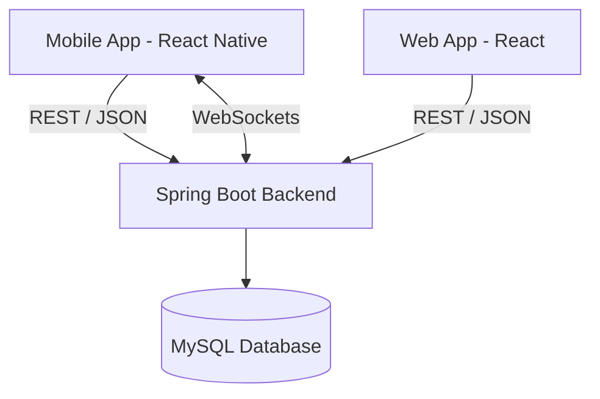
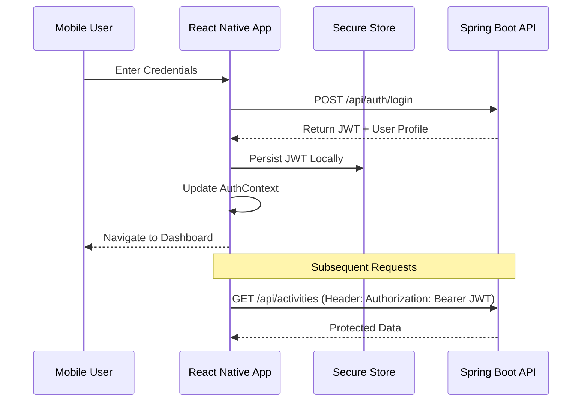

# Chapter: Mobile Application Implementation

## 1. Introduction to the Mobile Version
To ensure the **Inspector Platform** remains accessible and interactive while users are in the field (schools, training centers, or transit), a dedicated mobile application was developed. The mobile version extends the core functionalities of the web platform, providing inspectors and teachers with real-time access to their schedules, communications, and evaluation data.

## 2. Technical Architecture
The mobile application is built using a modern cross-platform stack to ensure performance and maintainability.

### 2.1 Technology Stack
- **Framework**: React Native with **Expo SDK**.
- **Navigation**: React Navigation (Stack and Tab navigators).
- **State Management**: React Context API for global authentication and session state.
- **API Communication**: Axios with interceptors for JWT token handling.
- **Real-time**: WebSockets (Stomp/SockJS) for the messenger module.
- **Notifications**: Expo Notifications for push alerts.

### 2.2 System Integration
The mobile app functions as a "Thin Client," consuming the same **Spring Boot REST API** used by the web frontend. This shared backend approach ensures data consistency across all platforms.

## 3. Key Modules & Screens

### 3.1 Authentication & Role-Based Navigation
Upon login, the application identifies the user's role (Inspector or Teacher) and adapts the interface.
- **LoginScreen**: Secure entry point using JWT.
- **RoleCalendarScreen**: A centralized dashboard showing the user's personal pedagogical timetable.

### 3.2 Activity Management
Inspectors can manage their field activities directly from their phones.
- **CreateActivityScreen**: Allows inspectors to schedule new inspections or meetings on the go.
- **ActivityDetailsScreen**: Provides full context for an activity, including location, time, and participants.

### 3.3 Real-time Messenger
One of the most critical features for field work is the ability to communicate instantly.
- **ConversationsScreen**: Lists all active chat threads.
- **ChatScreen**: Real-time messaging interface with status indicators.
- **ContactsScreen**: Directory of colleagues and teachers for quick communication.

### 3.4 Notification System
The mobile app leverages native device capabilities to keep users informed.
- **NotificationsScreen**: A history of alerts regarding new assignments, report finalizations, or meeting reminders.
- **PushNotificationService**: Handles background alerts even when the app is closed.

## 4. UI/UX Design for Mobile
The mobile design follows a "Mobile-First" philosophy, focusing on:
1. **Thumb-Friendly Navigation**: Use of bottom tab bars for primary actions.
2. **High Contrast & Readability**: Clean typography and distinct status badges for field use in various lighting conditions.
3. **Adaptive Layouts**: Using Flexbox to ensure the UI scales across various screen sizes (iOS and Android).

## 5. Implementation Detail: Mobile Authentication Flow
The following sequence diagram describes how the mobile app handles secure sessions.

## 6. Conclusion
The mobile implementation transforms the Inspector Platform into a truly ubiquitous tool. By prioritizing mobility and real-time communication, the application effectively bridges the gap between administrative planning and field-based pedagogical evaluation.
