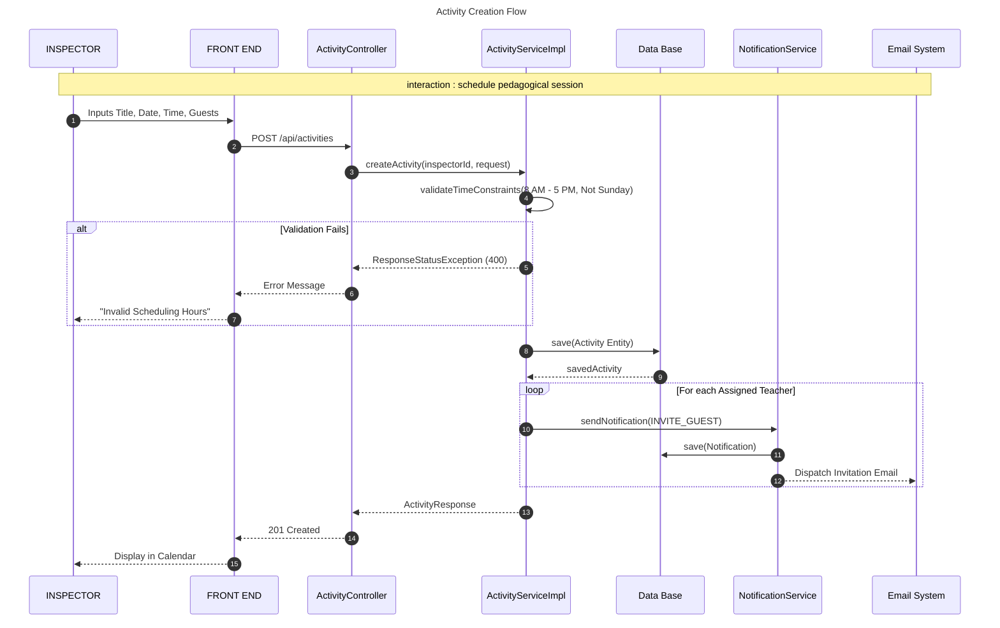
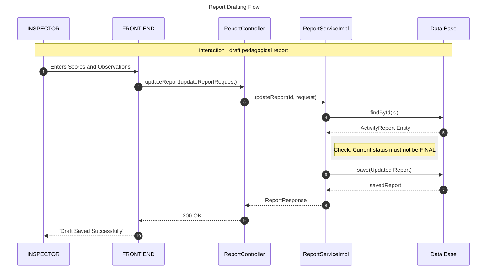
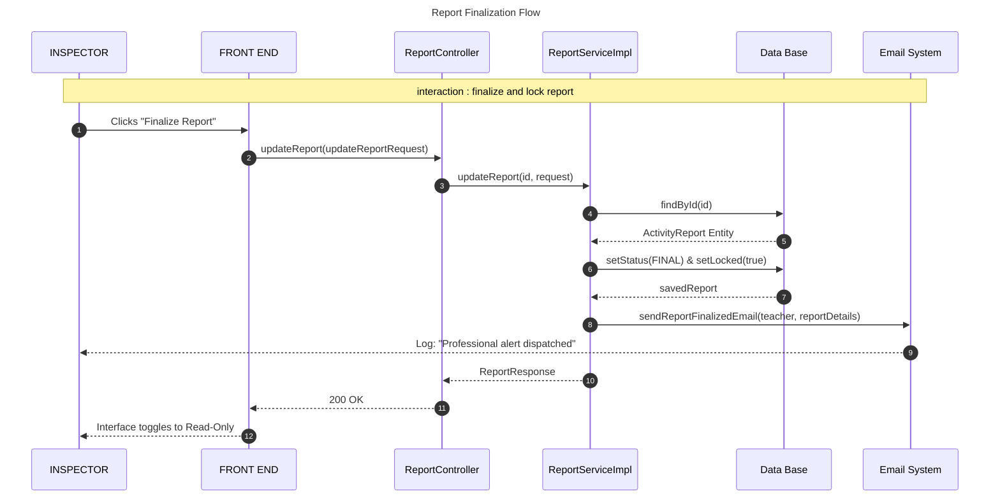
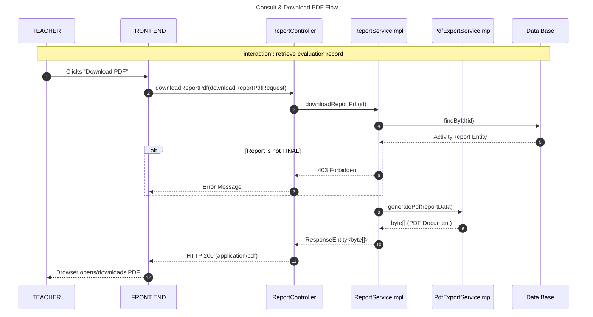

# Sprint 2 Sequence Diagrams: Pedagogical Supervision

This document contains the detailed UML sequence diagrams for the workflows implemented in Sprint 2.

## 1. Activity Creation & Planning
This diagram shows the process of scheduling a pedagogical session, including time validation and automated notifications.



## 2. Report Drafting & Update
This flow covers the iterative process of an inspector writing a pedagogical report.



## 3. Report Finalization & Locking
This is the critical workflow that locks the report and notifies the teacher.



## 4. Consult & Download PDF (Teacher)
This flow shows how a teacher accesses their finalized professional record.



## 5. Join Online Session (Jitsi)
This diagram illustrates the integration with the virtual classroom infrastructure.

```mermaid
sequenceDiagram
    title: Join Online Session Flow
    autonumber
    participant ACTOR as INSPECTOR/TEACHER
    participant FE as FRONT END
    participant OMS as OnlineMeetingService
    participant JS as Jitsi External Server

    Note over ACTOR, JS:    OnlineSession: virtual pedagogical session

    ACTOR->>FE: Clicks "Join Online Session"
    FE->>OMS: getMeetingLink(activityId)
    OMS-->>FE: Secure Jitsi URL

    FE->>JS: Open Room Window
    JS->>ACTOR: Connect Camera/Microphone
    JS-->>ACTOR: Virtual Room Interface
```
