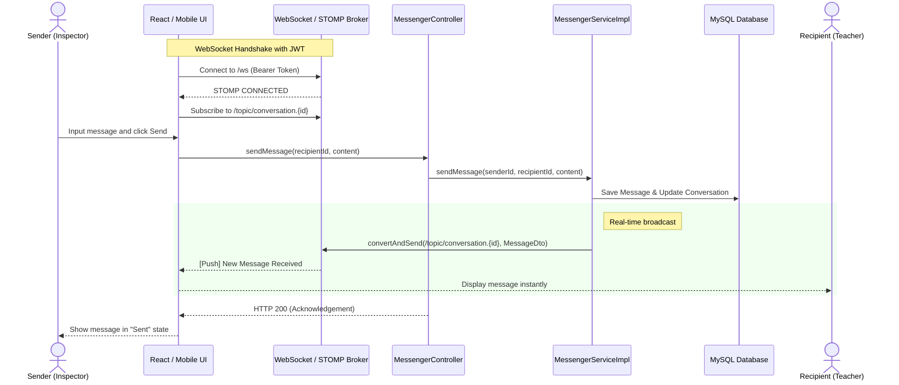
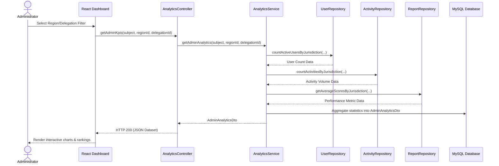
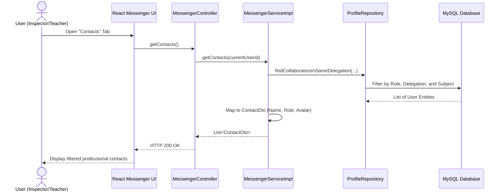

# Sprint 4 Sequence Diagrams: Communication & Governance

## 5.4 Design

### 5.4.1 Sequence Diagrams

This section details the operational logic for the Communication and Governance module. These diagrams illustrate the real-time interaction model of the platform's messaging system and the complex data aggregation workflows used by the analytical "Command Center" dashboard.

**Main Actors and Roles:**
*   **Administrator**: Monitors system-wide performance and geographical trends through the analytics engine.
*   **Inspector / Teacher**: Collaborators who engage in professional dialogue through the real-time messenger.
*   **AnalyticsService**: The engine responsible for cross-referencing user activity, geographical data, and pedagogical results to generate high-level KPIs.
*   **WebSocket / STOMP Broker**: Facilitates instantaneous message delivery without the need for manual page refreshes or polling.
*   **MessengerService**: Manages the persistence of conversations and handles professional contact matching logic.

---

## 1. Real-Time Messaging Sequence (WebSocket/STOMP)
Illustrates how the platform establishes a persistent connection to enable instantaneous communication between pedagogical collaborators.

---

## 2. title:Admin Analytics & KPI Filtering Sequence
Details the multi-layered data aggregation process that powers the Governance dashboard, allowing Administrators to drill down into regional performance.

---

## 3. Professional Contact Discovery Sequence
Shows the automated matching logic that ensures users only see relevant collaborators within their professional scope.

