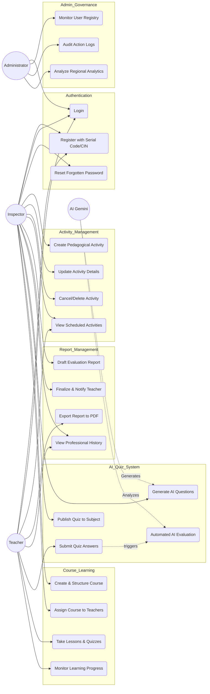

# Inspector Platform - Detailed Use Case Diagram

This diagram provides a granular view of the system's functionalities, detailing the specific CRUD operations and professional workflows for each actor.

## 📋 Use Case Breakdown (CRUD & Business Logic)

| Module | Use Case | Actor | CRUD/Logic Description |
| :--- | :--- | :--- | :--- |
| **Activities** | Create/Update/Delete | Inspector | Managing the pedagogical calendar and meeting types (Online/Physical). |
| **Reports** | Finalize & Notify | Inspector | Locking a report and triggering an automatic notification to the teacher. |
| **Reports** | Export PDF | Teacher/Inspector | Generating a formatted professional document for administrative records. |
| **AI Quiz** | Generate | Inspector | Using Gemini to create subject-specific questions dynamically. |
| **AI Quiz** | Automated Eval | AI System | Real-time analysis of submissions with pedagogical feedback. |
| **Courses** | Structure/Assign | Inspector | Building modular professional development content for their district. |
| **Governance** | Audit Logs | Administrator | Reviewing the timeline of all critical system actions for security. |
| **Governance** | Regional BI | Administrator | High-level data visualization of pedagogical impact across delegations. |
