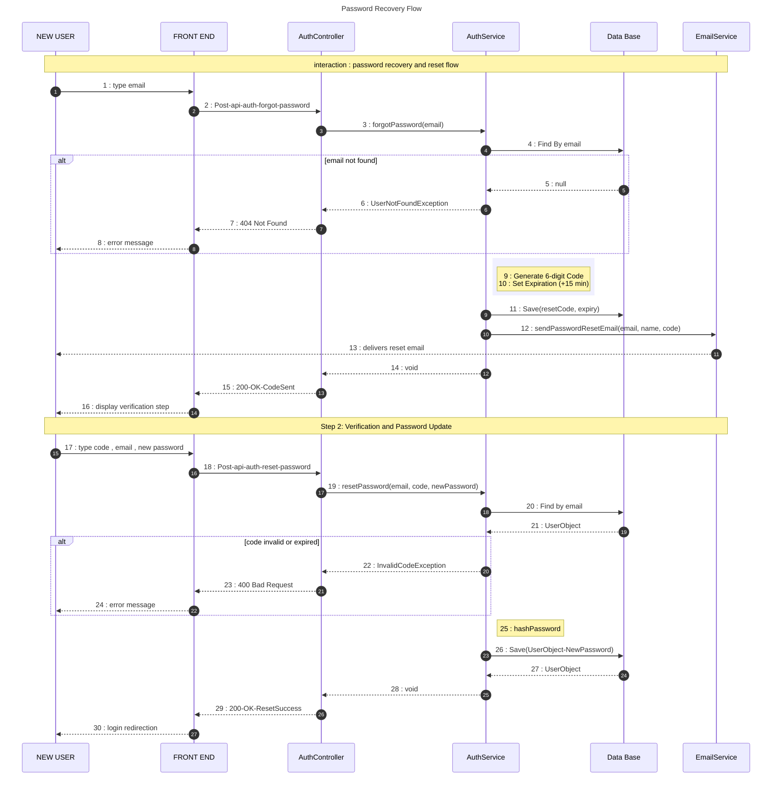

# Forgot Password Sequence Diagram (UML Style)

This diagram follows the project's architectural documentation style, illustrating the interactions between the User, Frontend, and Backend services.

## 🔄 Sequence: Password Recovery Flow

## 📋 Sequence Breakdown

| Step | Action | Description |
| :--- | :--- | :--- |
| **1-8** | **Email Validation** | Verifies if the email exists in the system. Returns a 404 if the user is unknown. |
| **9-11** | **Code Generation** | Creates a temporary 6-digit token and persists it with a 15-minute TTL. |
| **12-16** | **Notification** | Triggers the `EmailService` to send the branded HTML email to the user. |
| **17-24** | **Verification** | Validates the user-provided code against the database record and checks for expiration. |
| **25-30** | **Finalization** | Re-hashes the new password and updates the user record, clearing the reset fields. |
