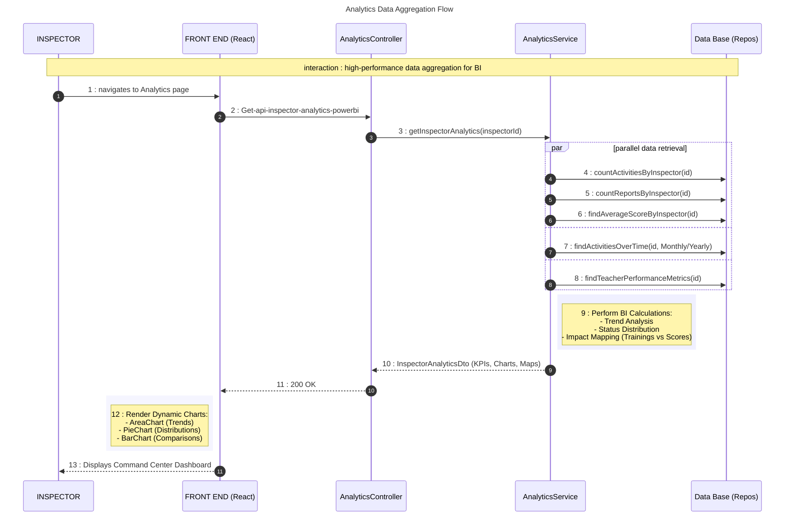

# PowerBI Analytics Sequence Diagram

This diagram documents the advanced data aggregation flow for the PowerBI-style Analytics Dashboard, showing how pedagogical data is transformed into actionable visual insights.

## 🔄 Sequence: Analytics Data Aggregation Flow

## 📋 Key Operations

| Operation | Component | Description |
| :--- | :--- | :--- |
| **KPI Extraction** | `AnalyticsService` | Aggregates high-level metrics like Total Activities, Finalized Reports, and Global Quality Index. |
| **Trend Analysis** | `DB Repositories` | Uses temporal queries to group activities by month/year for time-series visualization. |
| **Impact Analysis** | `AnalyticsService` | Correlates formation activities with teacher score trends to measure pedagogical impact. |
| **UI Rendering** | `Recharts Library` | Transforms the JSON dataset into interactive, premium-designed SVG charts with tooltips and animations. |
