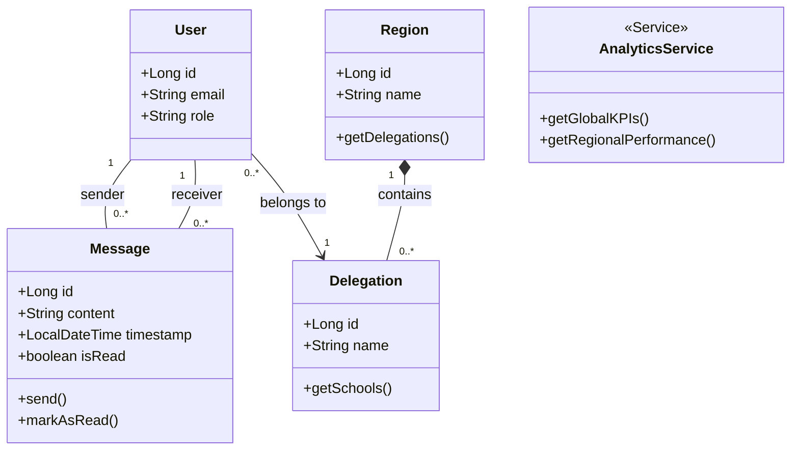

# Chapter 4: Implementation (Sprint 4)

## 4.4 Sprint 4: Communication & Governance

### 4.4.1 Sprint Objective
The objective of this sprint is to enhance professional collaboration through real-time messaging and provide administrative oversight via a Business Intelligence (BI) command center.

### 4.4.2 Sprint Backlog
| ID | Feature | ID US | User Story | Priority |
| :--- | :--- | :--- | :--- | :--- |
| **F10** | **Messenger** | US10.1 | As a User, I want to view a list of my professional contacts. | Medium |
| | | US10.2 | As a User, I want to send and receive real-time messages from my collaborators. | Medium |
| **F11** | **Admin Analytics** | US11.1 | As an Admin, I want to view high-level platform KPIs (total users, activities). | High |
| | | US11.2 | As an Admin, I want to filter metrics by Region and Delegation to analyze local performance. | High |
| | | US11.3 | As an Admin, I want to view interactive charts ranking regional pedagogical performance. | High |

### 4.4.3 Main Actors and Roles
* **Administrator**: The primary actor for the Governance module. They use the Business Intelligence (BI) dashboard to monitor system-wide activity, geographical performance, and user statistics.
* **General User (Inspector/Teacher)**: Utilize the messaging module to facilitate direct, secure communication without leaving the platform ecosystem.

### 4.4.4 Class Diagram
The following class diagram represents the structural model for messaging and regional analytics.



### 4.4.5 Use Case Diagram
This diagram outlines the primary interactions for communication and analytics.

```mermaid
useCaseDiagram
    actor "Administrator" as ADM
    actor "User (Any Role)" as USR
    
    package "Communication & Governance" {
        usecase "Send/Receive Direct Messages" as UC1
        usecase "View Contact List" as UC2
        usecase "Consult Global KPIs" as UC3
        usecase "Filter Analytics by Region" as UC4
        usecase "View Performance Rankings" as UC5
    }

    USR --> UC1
    USR --> UC2
    
    ADM --> UC3
    ADM --> UC4
    ADM --> UC5
    
    UC4 ..> UC3 : <<extends>>
```

### 4.4.6 Analysis of the Sprint
This sprint focuses on the **Analytics & Collaboration Layer**. To provide a responsive BI experience, we implemented robust data aggregation strategies in the `AnalyticsService`. When an Admin requests regional data, the system queries the database to count users, activities, and calculate average evaluation scores across the specified jurisdiction (Region/Delegation). 

Simultaneously, the introduction of the Messenger feature provides a dedicated channel for pedagogical discussions, eliminating the need for fragmented communication via external emails or unmanaged chat applications.

### 4.4.7 Descriptive Table of Use Case: Analyze Regional Performance
| Element | Description |
| :--- | :--- |
| **Use Case** | **Analyze Regional Pedagogical Performance** |
| **Actors** | Administrator |
| **Pre-conditions** | Administrator must be authenticated; regional data must exist in the database. |
| **Post-conditions** | System renders updated visual KPIs based on geographic filters. |
| **Nominal Scenario** | 1. Admin accesses the Analytics Dashboard.<br>2. Admin selects a specific Region or Delegation from the filter dropdown.<br>3. System queries the backend for filtered metrics.<br>4. Backend aggregates teacher scores and activity volumes for that jurisdiction.<br>5. System renders interactive charts (e.g., bar charts, pie charts) with the updated data. |
| **Exceptions** | - **Data Unavailable**: If a region has no registered users or activities, the charts display "No Data". |

### 4.4.8 Descriptive Table of Use Case: Direct Messaging
| Element | Description |
| :--- | :--- |
| **Use Case** | **Send Direct Message** |
| **Actors** | User (Any Role) |
| **Pre-conditions** | User must be authenticated and select a valid contact. |
| **Post-conditions** | Message is persisted and delivered to the recipient. |
| **Nominal Scenario** | 1. User opens the Messenger interface.<br>2. User selects a collaborator from their contact list.<br>3. User types a message and clicks send.<br>4. System persists the message entity.<br>5. Recipient UI updates with the new message and an unread indicator. |
| **Exceptions** | - **Network Error**: If the message fails to send, a retry prompt is shown. |

### 4.4.9 Description of Sequence Diagrams
**1. PowerBI Analytics Sequence**
Illustrates the complex data fetching logic for the BI dashboard. It highlights how the Frontend requests aggregated data, and how the `AnalyticsService` interacts with multiple repositories (User, Activity, Report) to build a comprehensive DTO containing high-level regional insights.

**2. Messaging Sequence**
Details the flow of fetching conversation histories and sending new messages between users, including the marking of messages as "Read".

### 4.4.10 Interface Demonstrations
*Note: Ensure to add screenshots to the `screenshots/` directory before finalizing the report.*

**Figure 1 – Admin Analytics Dashboard**: The command center view showing global KPIs, region filters, and performance ranking charts.
*(Placeholder: admin_analytics_dashboard.png)*

**Figure 2 – Messenger Interface**: The chat interface showing the contact list and an active conversation thread.
*(Placeholder: messenger_interface.png)*

### 4.4.11 Backlog Conclusion
Sprint 4 completes the "Governance" aspect of the platform. By providing both a direct communication channel (Messenger) and a high-level analytical view (BI Dashboard), the platform empowers administrators to make informed decisions based on real-time pedagogical data and improves communication efficiency across all roles.
