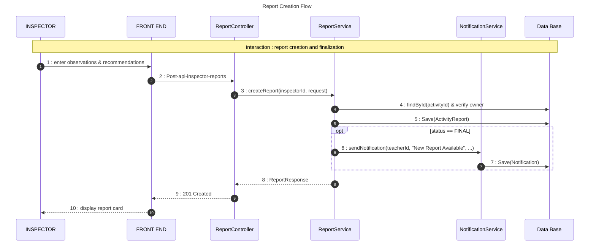
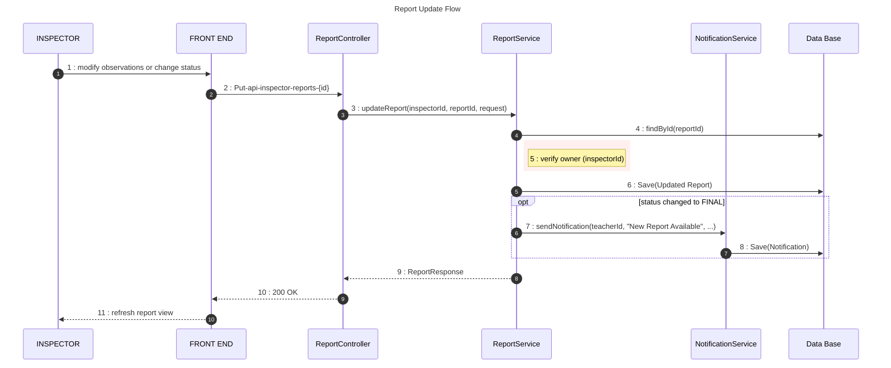
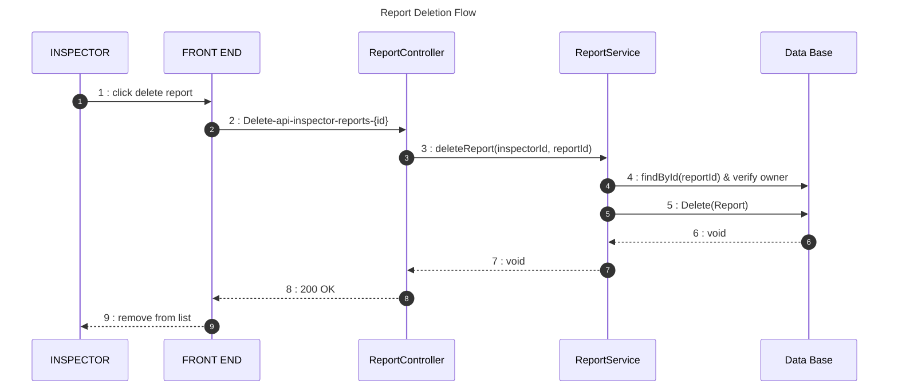
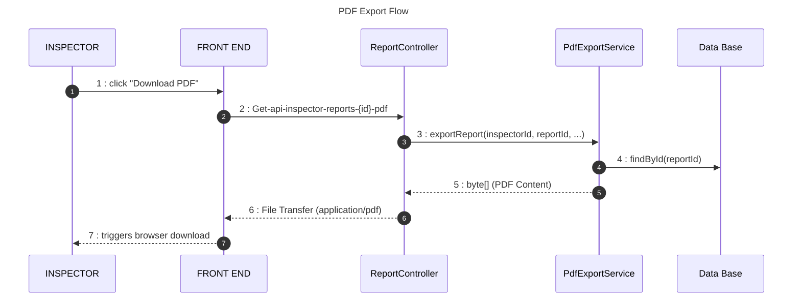

# Report Management Sequence Diagram (Full CRUD)

This diagram documents the complete lifecycle of a pedagogical report, including secure updates, finalization notifications, and deletion logic.

## 🔄 Sequence 1: Report Creation Flow

## 🔄 Sequence 2: Report Update Flow

## 🔄 Sequence 3: Report Deletion Flow

## 🔄 Sequence 4: PDF Operations

## 📋 Key Operations

| Operation | Component | Security/Logic |
| :--- | :--- | :--- |
| **Update** | `ReportService` | Dynamically triggers a teacher notification only when the status is transitioned to **FINAL**. |
| **Security** | **Ownership Check** | Prevents an inspector from modifying or deleting reports belonging to another inspector. |
| **Export** | `PdfExportService` | Generates a read-only document based on the current database state of the report. |
