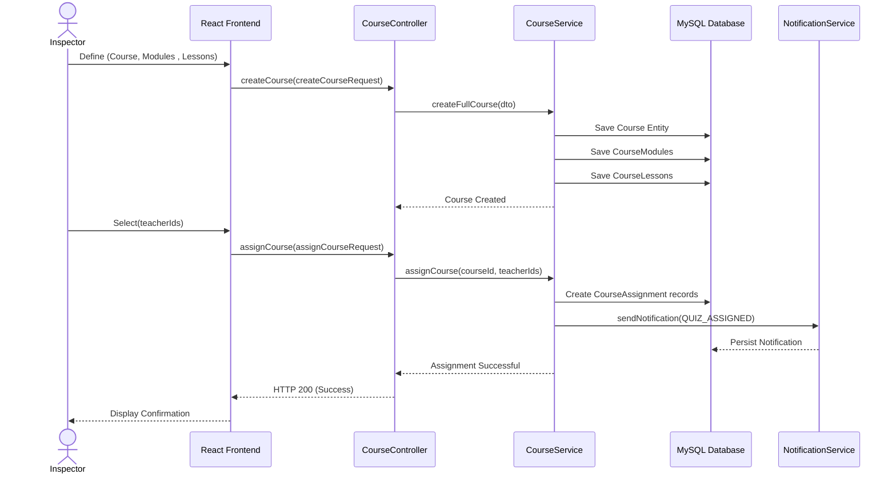
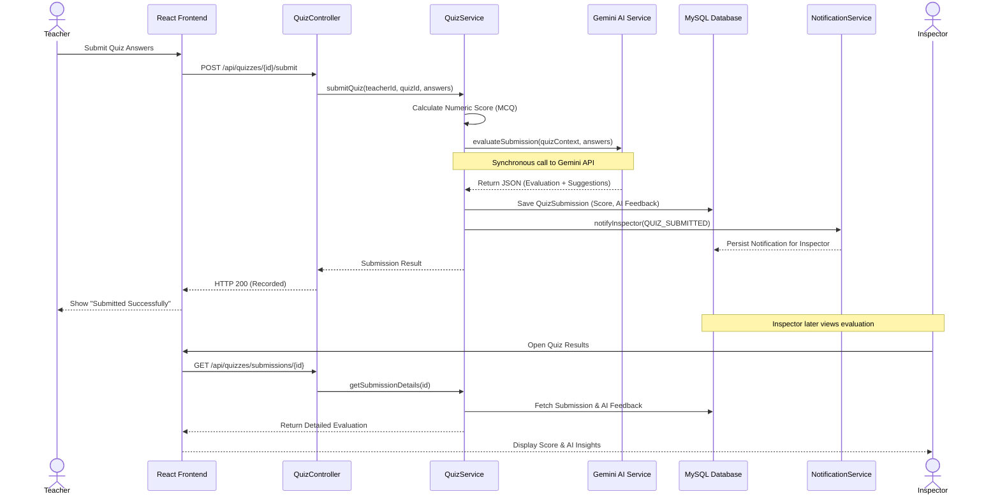
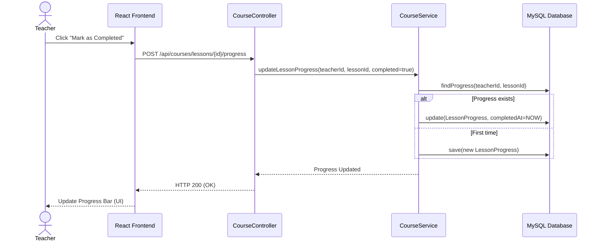
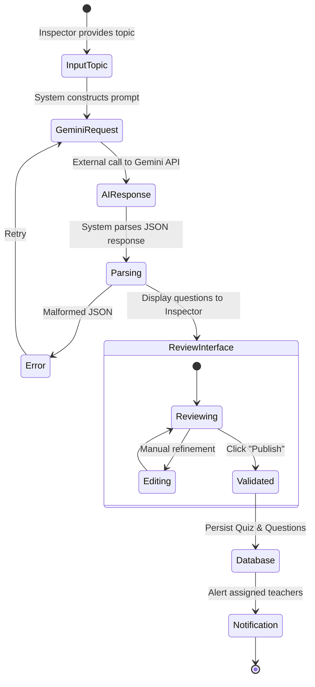
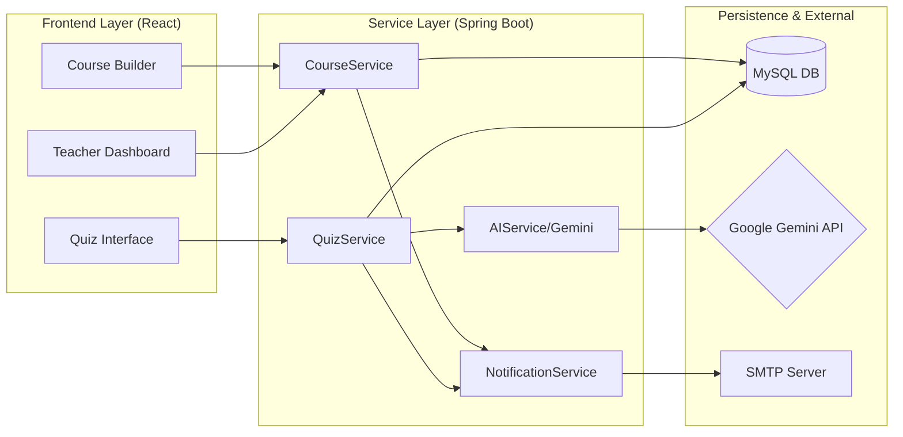
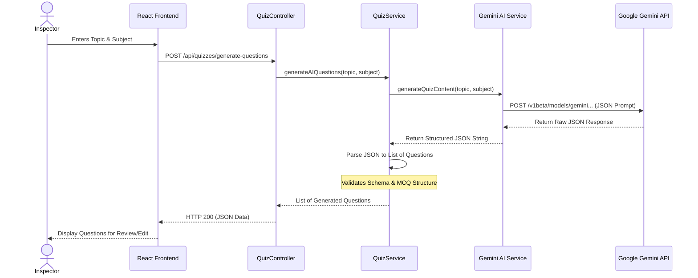

# Sprint 3 Sequence Diagrams: Course Management & AI Evaluation

## 5.3 Design

### 5.3.1 Sequence Diagrams

This section presents the main operational flows of the Pedagogical Training and AI Evaluation module through sequence diagrams. These diagrams provide a clear visualization of interactions between the frontend, backend services, AI engines, and notification mechanisms, helping to understand how complex pedagogical training workflows are executed step by step. They also guide the development process by ensuring that the AI integration and content management logic remain consistent with the defined business requirements.

**Main Actors and Roles:**
This sprint involves five main actors who collaborate to ensure the proper execution of the intelligent training cycle:
*   **Inspector**: The primary content orchestrator, responsible for building modular courses, uploading lessons, and using AI tools to generate contextual evaluation quizzes for their teachers.
*   **Teacher**: The primary beneficiary of the training module, who interacts with the platform to follow assigned courses, track their learning progress, and complete AI-driven quizzes.
*   **Gemini AI Service**: An intelligent system actor that provides the generative capabilities required to create structured quiz questions and perform deep qualitative analysis of teacher performance.
*   **Database (MySQL)**: The core persistence layer, responsible for storing the hierarchical curriculum data, AI-generated content, and fine-grained teacher progression logs.
*   **Notification/Email System**: A supporting component that facilitates engagement by alerting teachers of new professional development opportunities and notifying inspectors of completed evaluations.

Through this module, the platform transforms from an administrative tool into a smart training partner, providing Inspectors with AI-assisted content creation and giving Teachers a structured, data-driven path for professional growth.

## 1. Course Creation & Assignment Sequence
Illustrates the process by which an Inspector constructs a modular course and assigns it to specific teachers.

## 2. Quiz assessment Flow Sequence
Details the intelligent evaluation process when a teacher submits an assessment, including the synchronous call to the Gemini AI engine.

## 3. Lesson Progress Tracking Sequence
Details how the system records a teacher's completion of specific course materials.

## 4. Activity Diagram: AI Quiz Generation Lifecycle
Visualizes the human-in-the-loop process where AI generates content and the Inspector validates/edits it.

## 5. Component Diagram: Sprint 3 Architecture
Illustrates the physical and logical components involved in the Training & AI Evaluation module.

## 6. AI Quiz Generation Flow Sequence
Illustrates the interaction between the platform and the Google Gemini API to generate pedagogical assessments based on a specific topic.

## 5.4 Implementation

### 5.4.1 Interfaces description
The implementation of Sprint 3 focuses on providing a fluid, modern experience for both content creators and learners. The following interfaces were designed to facilitate the complex pedagogical training workflow:

*   **Course Builder Interface (Inspector)**: A structured management workspace where inspectors can create hierarchical courses, define modules, and upload various lesson materials (PDFs, Videos, and Links). It ensures that the curriculum is logically organized for the teachers.
*   **Teacher Learning Dashboard**: A personalized space for teachers to view their assigned courses. It includes a real-time progress tracker (percentage bar) and allows teachers to navigate through modules and mark lessons as completed to satisfy their professional development requirements.
*   **AI Quiz Generation Module**: An interactive tool where inspectors provide a pedagogical topic and subject. The system displays a loading state while communicating with the Gemini API and presents the generated questions in a review interface for final validation before publication.
*   **Inspector Review Dashboard (Quiz assessment)**: A specialized analytics view where inspectors can browse teacher quiz submissions. It displays the numeric score and provides a detailed drill-down into the qualitative AI evaluation and personalized training suggestions for each teacher.
