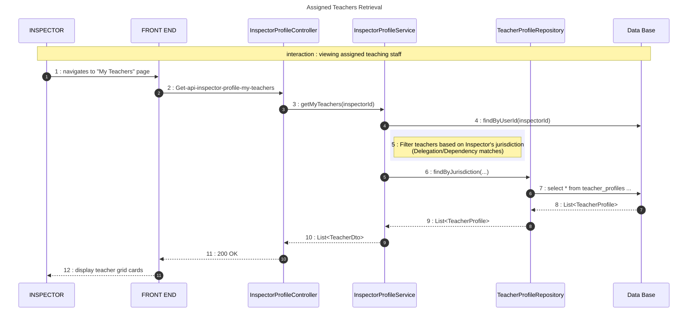
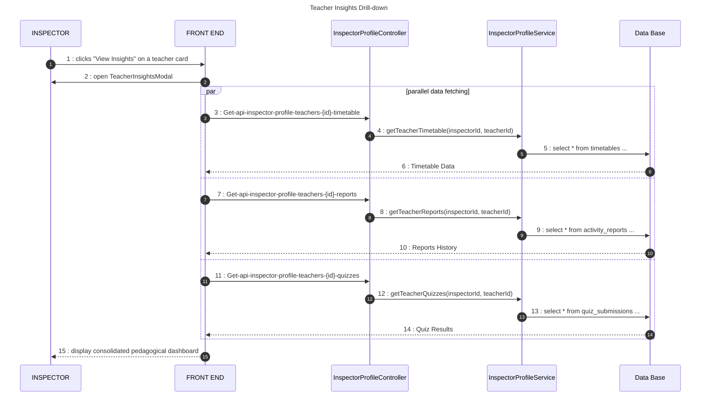

# Inspector-Teacher Management Sequence Diagram

This diagram documents the pedagogical supervision flow, where an Inspector manages their assigned teachers and analyzes their professional performance through various insights.

## 🔄 Sequence 1: Retrieve Assigned Teachers

## 🔄 Sequence 2: Teacher Insights (Pedagogical Drill-down)

## 📋 Key Operations

| Operation | Component | Description |
| :--- | :--- | :--- |
| **Filtering** | `InspectorProfileService` | Uses a complex cross-reference logic to identify teachers working in the same Delegations/Schools as the Inspector. |
| **Insights** | `TeacherInsightsModal` | Uses parallel API calls to populate the modal with Timetables, Reports, and Quiz data simultaneously for zero-latency feel. |
| **Security** | **Jurisdiction Check** | The backend verifies that the requested `teacherId` actually falls under the Inspector's supervision before returning data. |
