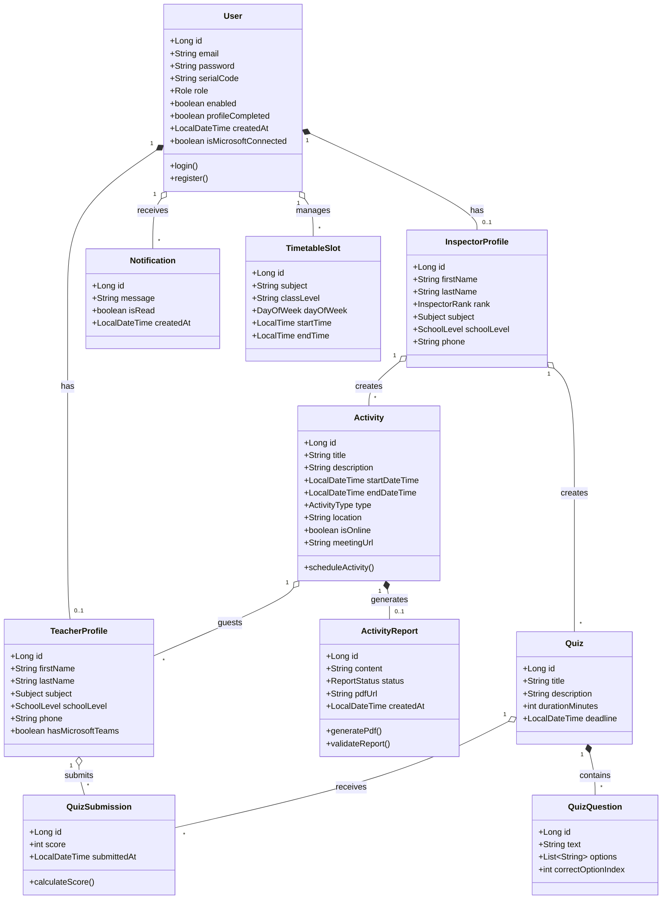
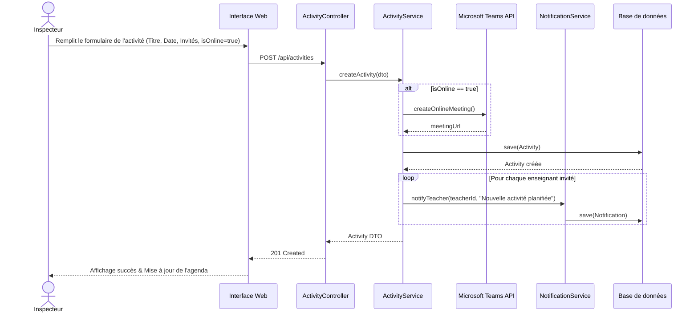
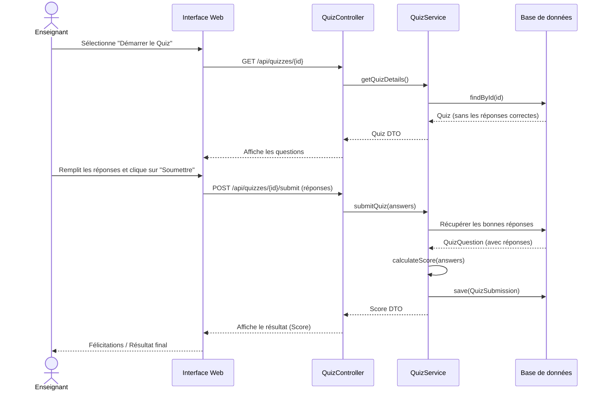
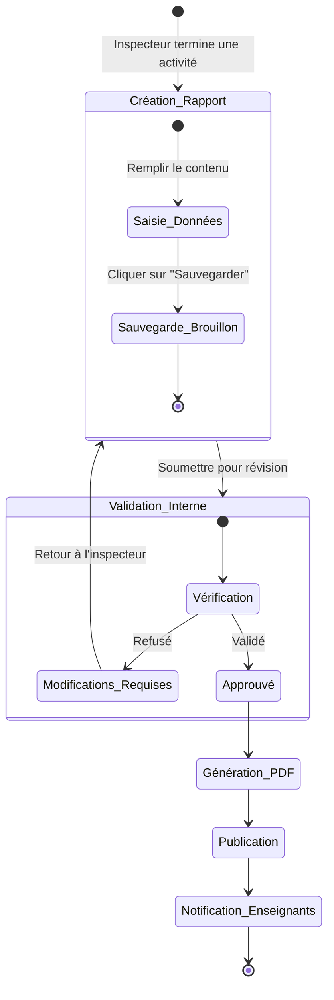
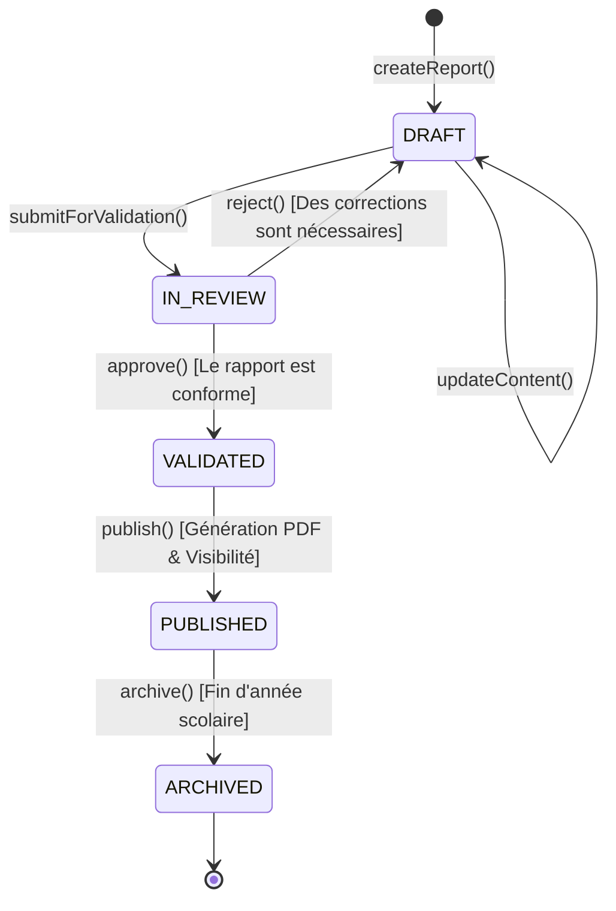

# Diagrammes UML pour le Rapport de PFE : Inspector Platform

Ce document regroupe les différents diagrammes UML nécessaires pour la conception de votre plateforme "Inspector Platform". Ils sont générés en utilisant la syntaxe Mermaid, que vous pouvez copier/coller dans des outils comme draw.io, ou visualiser directement sur GitHub ou Notion.

## 1. Diagramme de Cas d'Utilisation (Use Case Diagram)
Ce diagramme montre les interactions entre les différents acteurs (Inspecteur, Enseignant) et le système.

```mermaid
usecaseDiagram
    actor Inspecteur as "Inspecteur"
    actor Enseignant as "Enseignant"
    
    package "Inspector Platform" {
        usecase "S'authentifier (Email ou Microsoft)" as UC1
        usecase "Compléter son profil" as UC2
        
        usecase "Planifier une activité" as UC3
        usecase "Créer/Gérer un Quiz" as UC4
        usecase "Rédiger un rapport pédagogique" as UC5
        usecase "Gérer l'emploi du temps" as UC6
        usecase "Consulter le tableau de bord" as UC7
        
        usecase "Passer un Quiz" as UC8
        usecase "Consulter l'emploi du temps" as UC9
        usecase "Télécharger un rapport pédagogique" as UC10
        usecase "Consulter les notifications" as UC11
    }
    
    Inspecteur --> UC1
    Inspecteur --> UC2
    Inspecteur --> UC3
    Inspecteur --> UC4
    Inspecteur --> UC5
    Inspecteur --> UC6
    Inspecteur --> UC7
    Inspecteur --> UC11
    
    Enseignant --> UC1
    Enseignant --> UC2
    Enseignant --> UC8
    Enseignant --> UC9
    Enseignant --> UC10
    Enseignant --> UC11
    Enseignant --> UC7
    
    UC3 ..> UC1 : <<include>>
    UC4 ..> UC1 : <<include>>
    UC5 ..> UC1 : <<include>>
```

---

## 2. Diagramme de Classes (Class Diagram)
Ce diagramme illustre le modèle de données de l'application, les entités principales et leurs relations.



---

## 3. Diagrammes de Séquence (Sequence Diagrams)

### 3.1. Planification d'une Activité avec Réunion Teams
Ce diagramme montre le processus par lequel un inspecteur planifie une activité, génère un lien Teams, et le système notifie les enseignants.



### 3.2. Passage d'un Quiz par un Enseignant
Ce diagramme détaille comment un enseignant passe un quiz et comment le score est calculé et notifié.



---

## 4. Diagramme d'Activité (Activity Diagram)

### Processus de rédaction et de publication d'un rapport pédagogique
Ce diagramme montre le flux de travail de la création à la validation et la publication d'un rapport.



---

## 5. Diagramme d'États-Transitions (State Machine Diagram)

### Cycle de vie d'un Rapport (Activity Report)
Ce diagramme représente les différents états par lesquels passe l'entité `ActivityReport`.



## 6. Diagramme de Composants (Component Diagram - Optionnel pour PFE)
Vue macroscopique de l'architecture technique.

```mermaid
graph TD
    subgraph Frontend [Frontend (React / Vite)]
        UI[UI Components - Tailwind]
        State[State Management - Context/Redux]
        API_Client[Axios API Client]
    end

    subgraph Backend [Backend (Spring Boot)]
        Sec[Spring Security & JWT]
        Ctrl[REST Controllers]
        Svc[Service Layer]
        Repo[Data Access - Spring Data JPA]
    end

    subgraph External_Services [Services Externes]
        DB[(PostgreSQL)]
        MS_Teams[Microsoft Graph API / Teams]
    end

    UI --> State
    State --> API_Client
    API_Client -- HTTP / REST --> Sec
    Sec --> Ctrl
    Ctrl --> Svc
    Svc --> Repo
    Repo -- SQL --> DB
    Svc -- OAuth2 / REST --> MS_Teams
```
